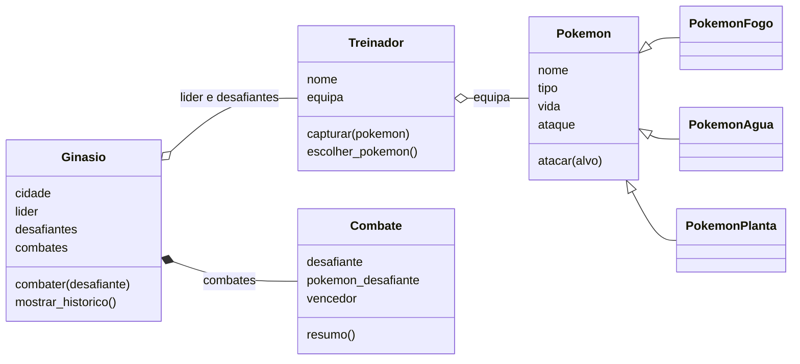

# Objetos, composição e comportamento

Este guia reúne a matéria de programação orientada a objetos em Python deste tema. Começa na ideia de classe e de objeto, passa pela forma de proteger o estado de um objeto e pela herança, chega à maneira como um objeto guarda outros objetos, que é a composição e a agregação, passa pelos métodos de classe, pelo duck typing e pelas dataclasses e acaba nos decoradores. O fio condutor é o mesmo das aulas: Pokémon, treinadores e ginásios.

É um texto para leres com calma, antes ou depois de uma aula, e perceberes o porquê de cada linha de código. Por isso cada ideia aparece explicada por mais do que um caminho: a definição, um exemplo do dia a dia, o exemplo dos Pokémon e o erro de quem a percebeu ao contrário.

## O que este guia cobre e o que ainda vai entrar

O guia está dividido em oito partes, que seguem, no essencial, a ordem em que a matéria é dada:

| Parte | Assunto |
| --- | --- |
| 1 | Paradigmas, classe e objeto, atributos, construtor, `self`, métodos dos objetos e métodos estáticos |
| 2 | Proteger o estado do objeto: get e set, público e privado, propriedades e a forma como as propriedades e o privado trabalham juntos |
| 3 | Herança: classes-filhas, `super()` e métodos reescritos |
| 4 | Composição e agregação, com o exemplo guiado do ginásio Pokémon |
| 5 | Métodos de classe: o `@classmethod`, o `cls` e os construtores alternativos |
| 6 | Duck typing: objetos de classes diferentes que respondem à mesma chamada, com o exemplo guiado dos anunciadores do ginásio |
| 7 | Dataclasses: classes que guardam dados, com o `@dataclass`, os campos e as anotações de tipo, e os casos em que não servem |
| 8 | Decoradores: uma função é um valor, entregar uma função sem a chamar, e o que faz a arroba nos decoradores que já usas |

Com a parte 8, este tema fica completo. A primeira janela feita com tkinter não entra neste guia: vem mais à frente, quando o exemplo dos Pokémon passar a ser uma aplicação completa, com a equipa guardada num ficheiro.

Além deste guia, o tema tem mais dois documentos com o mesmo número, um para cada uso:

- o [laboratório](03-objetos-e-composicao-laboratorio.md), com os passos para construíres no computador o ginásio Pokémon da parte 4, com o guia aberto ao lado;
- a [ficha de exercícios](03-objetos-e-composicao-exercicios.md), para praticares sem ajuda.

A ficha tem exercícios das oito partes, e o laboratório das sete primeiras. A parte 8 explica um mecanismo e não constrói nada novo no ginásio, por isso não tem parte própria no laboratório.

O código completo dos exemplos das aulas está em três ficheiros: [pokemon.py](../exemplos/python-avancado/pokemon/03-objetos-e-composicao/pokemon.py), com a classe `Pokemon` e as suas classes-filhas; [ginasio.py](../exemplos/python-avancado/pokemon/03-objetos-e-composicao/ginasio.py), com o treinador, o líder, o ginásio e o registo dos combates; e [anunciadores.py](../exemplos/python-avancado/pokemon/03-objetos-e-composicao/anunciadores.py), com os anunciadores da parte 6.

## O que precisas de saber antes

Este guia parte do Python que trabalhaste no 10.º ano e que revimos no início das aulas deste tema. Não volta a ensinar essa matéria: usa-a. Antes de começares, confirma que consegues fazer o que está nesta lista.

Vais usar variáveis, os tipos `int`, `float`, `str` e `bool`, e as decisões com `if`, `elif` e `else`. Vais usar ciclos `for` para percorrer uma lista e, na parte 4, um ciclo `while True` que só acaba quando chega a um `break`. Vais usar listas: criar uma lista vazia com `[]`, acrescentar um elemento com `append`, contar os elementos com `len`, percorrer a lista com `for` e perguntar se um valor está lá dentro com `in` ou `not in`. Na ficha de exercícios, vais também tirar um elemento de uma lista com `remove`. Há um exemplo com um dicionário, logo no início, para comparar com a forma nova de trabalhar.

Vais usar funções com parâmetros e com `return`, e vais precisar de te lembrar de duas coisas sobre elas: os parâmetros de uma função só existem enquanto a função está a correr, e uma função pode devolver `None` para dizer que não encontrou nada. Para perguntar se um valor é `None`, escreve-se `valor is None`. Nos exemplos deste guia, cada função e cada método tem, logo a seguir ao `def`, uma docstring, como as das funções do 10.º: um texto entre três aspas que explica o que a função faz.

Vais usar as f-strings, como `f"{nome} tem {vida} de vida."`, que escrevem o valor de cada variável no sítio das chavetas.

A partir da parte 2, e no laboratório, um ficheiro vai usar classes que estão noutro ficheiro da mesma pasta, com uma linha como `from pokemon import PokemonFogo`. Vais precisar também de reconhecer a linha `if __name__ == "__main__":`, que viste no 10.º: o código que está debaixo dela só corre quando executas esse ficheiro diretamente, e não quando outro ficheiro o importa. Na parte 7, um ficheiro vai importar de um módulo que vem com o Python, com a linha `from dataclasses import dataclass`, que a própria parte 7 explica.

Se alguma destas ideias estiver esquecida, os guias de Python do 10.º ano continuam a ser a melhor referência. A parte 4 usa também uma ideia do guia de memória do 10.º, sobre referências. Não precisas de o reler: a parte 4 explica essa ideia desde o início.

## Como ler este guia

Cada parte tem teoria com exemplos completos, uma secção de erros frequentes e umas perguntas para verificares se percebeste. Os exemplos são programas curtos que podes copiar para um ficheiro e executar. A regra é sempre a mesma: antes de executares um programa, escreve o que achas que ele vai mostrar, e só depois compara. Se escreveres a previsão depois de ver o resultado, a comparação concorda sempre contigo e não te ensina nada.

Para executar um exemplo, guarda-o num ficheiro com a extensão `.py`, abre o terminal do VS Code na pasta desse ficheiro e escreve `python3 nome-do-ficheiro.py`. No Windows, se `python3` não funcionar, experimenta `python` ou `py`.

Todos os programas deste guia foram executados em Python 3.14 e também em Python 3.9, e as saídas mostradas são as reais. As saídas dos programas são iguais nas duas versões. Nas mensagens de erro, o Python mostra várias linhas, com o caminho do ficheiro no teu computador, e só a última linha diz qual foi o erro. Por isso o guia mostra apenas essa última linha. Nas versões mais recentes, essa linha pode acabar com uma sugestão do tipo `Did you mean: ...?`, que as versões antigas não mostram, e há nove erros, dois na parte 1, dois na parte 2, dois na parte 5, um na parte 6 e dois na parte 7, em que o texto muda de uma versão para a outra. Quando isso acontece, o guia diz também como é a mensagem nas versões antigas.

## Parte 1: Classes e objetos

### Paradigmas: maneiras de organizar um programa

Um **paradigma de programação** é uma maneira de organizar um programa: uma forma de pensar sobre onde ficam os dados e onde fica o código que trabalha com eles. A mesma linguagem pode permitir mais do que um paradigma, e o Python permite vários.

No 10.º ano programaste sobretudo de forma **estruturada**, também chamada procedimental. Um programa estruturado é uma sequência de instruções, com decisões e ciclos, dividida em funções. Os dados vivem em variáveis, listas e dicionários, e as funções recebem esses dados por parâmetro, trabalham com eles e devolvem um resultado. Os dados estão de um lado e as funções estão do outro.

Na **programação orientada a objetos**, a que vamos chamar POO, o programa organiza-se à volta de objetos. Um objeto junta num só sítio os dados que descrevem uma coisa e as ações que essa coisa sabe fazer. Um Pokémon tem um nome, um tipo, uma vida e um ataque, e sabe atacar outro Pokémon e verificar a sua vida. Em POO, esses dados e essas ações ficam juntos, dentro do objeto Pokémon.

Existem outros paradigmas, como a programação funcional, mas não fazem parte deste guia. Aqui interessa-nos a diferença entre as duas formas que conheces agora: a estruturada, que já usavas, e a orientada a objetos, que é a matéria nova. Nenhuma é melhor em todas as situações. A POO ajuda quando o programa cresce e há regras que têm de ser sempre cumpridas, porque permite pôr cada regra ao lado dos dados que ela protege. A secção seguinte mostra porquê.

### O problema de um Pokémon guardado num dicionário

Com o que aprendeste no 10.º, um Pokémon pode ser guardado num dicionário, e o ataque pode ser uma função que recebe dois dicionários:

```python
charmander = {"nome": "Charmander", "tipo": "Fogo", "vida": 90, "ataque": 40}
bulbasaur = {"nome": "Bulbasaur", "tipo": "Planta", "vida": 110, "ataque": 25}


def atacar(atacante, alvo):
    """Tira ao alvo tanta vida quanto o ataque do atacante."""
    alvo["vida"] = alvo["vida"] - atacante["ataque"]
    print(f"{atacante['nome']} ataca {alvo['nome']}.")


atacar(charmander, bulbasaur)
print(bulbasaur["vida"])
bulbasaur["vida"] = -500      # ninguém impede uma vida negativa
bulbasaur["vidda"] = 100      # nem uma chave mal escrita
print(bulbasaur)
```

O programa mostra:

```text
Charmander ataca Bulbasaur.
70
{'nome': 'Bulbasaur', 'tipo': 'Planta', 'vida': -500, 'ataque': 25, 'vidda': 100}
```

As duas primeiras linhas estão certas: o Bulbasaur tinha 110 de vida, levou 40 e ficou com 70. O problema está na última linha, e são três problemas diferentes.

O primeiro é que o dicionário aceita qualquer valor. A vida de um Pokémon devia estar sempre entre 0 e 150, mas o programa guardou -500 sem protestar. Nada no dicionário sabe que existe uma regra para a vida.

O segundo é que um engano no nome de uma chave não dá erro. Quem escreveu `"vidda"` queria mudar a vida, mas o Python criou uma chave nova, e a vida verdadeira ficou com -500. Um engano destes pode passar semanas sem ninguém dar por ele.

O terceiro é o mais importante. A regra da vida entre 0 e 150 teria de ser escrita em todas as funções que mudam a vida: na que ataca, na que cura, na que aplica um veneno. Basta uma dessas funções esquecer a regra para o Pokémon ficar num estado impossível. Os dados estão num sítio e as regras estão espalhadas por outros.

A programação orientada a objetos resolve o primeiro e o terceiro problemas ao pôr a regra dentro do próprio Pokémon, de forma que qualquer alteração da vida passe por ela. É o caminho que este guia percorre até ao fim da parte 2. O segundo problema, o do nome mal escrito, também existe com classes: numa classe, `bulbasaur.vidda = 100` cria um atributo novo sem dar erro, tal como o dicionário criou uma chave nova.

### Classe e objeto: o molde e as peças

Uma **classe** é a descrição de um tipo de coisa: diz que dados cada coisa desse tipo tem e o que sabe fazer. Um **objeto** é uma coisa concreta, criada a partir de uma classe, com os seus próprios valores. Também se diz que um objeto é uma **instância** da classe: as duas palavras querem dizer o mesmo.

Pensa numa forma de fazer bolos. A forma não é um bolo, não se come, e só existe uma. Com ela fazes muitos bolos, todos com o mesmo formato, e cada bolo pode ter um recheio diferente. A classe é a forma, e cada objeto é um bolo. Outro exemplo: uma ficha de inscrição em branco diz que campos existem (nome, data de nascimento, turma); cada ficha preenchida é uma inscrição concreta, com valores próprios. A ficha em branco é a classe, e cada ficha preenchida é um objeto.

No mundo dos Pokémon, a classe `Pokemon` diz que todo o Pokémon tem nome, tipo, vida e ataque. O Charmander com 90 de vida que tens na equipa é um objeto dessa classe, e o Bulbasaur com 110 de vida é outro objeto da mesma classe.

Já usaste objetos em Python sem lhes dares esse nome. Uma lista é um objeto da classe `list`, e quando escreves `numeros.append(5)` estás a pedir a esse objeto que faça uma ação:

```python
numeros = [3, 1, 2]
print(type(numeros))
numeros.append(5)
print(numeros)
```

```text
<class 'list'>
[3, 1, 2, 5]
```

A novidade deste tema é criares as tuas próprias classes. Esta é a primeira versão da classe `Pokemon`, só com dados:

```python
class Pokemon:
    """Primeira versão da classe: só os dados de um Pokémon."""

    def __init__(self, nome, tipo, vida, ataque):
        """Cria um Pokémon com nome, tipo, vida e ataque."""
        self.nome = nome
        self.tipo = tipo
        self.vida = vida
        self.ataque = ataque


charmander = Pokemon("Charmander", "Fogo", 90, 40)
bulbasaur = Pokemon("Bulbasaur", "Planta", 110, 25)
print(charmander.nome, charmander.vida)
print(bulbasaur.nome, bulbasaur.vida)
bulbasaur.vida = bulbasaur.vida - charmander.ataque
print(bulbasaur.nome, bulbasaur.vida)
print(charmander.nome, charmander.vida)
```

```text
Charmander 90
Bulbasaur 110
Bulbasaur 70
Charmander 90
```

A linha `class Pokemon:` começa a classe, e tudo o que está indentado debaixo dela pertence à classe. A primeira linha indentada é a docstring da classe, entre três aspas, que diz o que a classe representa, e o `def` que vem a seguir tem a sua, como qualquer função. O nome de uma classe escreve-se, por convenção, com maiúscula inicial e sem sublinhados, como `Pokemon` ou `PokemonFogo`, para se distinguir à primeira vista das variáveis e das funções, que se escrevem em minúsculas. Nos nossos programas, os nomes das classes também não levam acentos, embora o Python os aceite: escreve-se `Pokemon` e `Ginasio`, e não `Pokémon` nem `Ginásio`.

A linha `charmander = Pokemon("Charmander", "Fogo", 90, 40)` cria um objeto novo e guarda-o na variável `charmander`. Escreve-se o nome da classe seguido de parênteses, como se a classe fosse uma função, e os valores entre parênteses são os dados iniciais do objeto. A linha seguinte cria outro objeto, independente do primeiro.

Para ler um dado de um objeto, escreve-se o nome da variável, um ponto e o nome do dado: `charmander.nome`. Para o alterar, usa-se a mesma escrita do lado esquerdo de um `=`: `bulbasaur.vida = bulbasaur.vida - charmander.ataque`.

Repara nas duas últimas linhas da saída. A vida do Bulbasaur desceu para 70, mas a vida do Charmander continuou em 90. Cada objeto tem os seus próprios valores, e mudar um objeto não muda os outros objetos da mesma classe, tal como pôr chocolate num bolo não põe chocolate nos outros bolos feitos com a mesma forma.

### Atributos: o que cada objeto guarda

Aos dados de um objeto, como `nome`, `tipo`, `vida` e `ataque`, chama-se **atributos**. Um atributo é uma variável que pertence a um objeto: cada objeto tem a sua cópia, com o seu valor.

Ao conjunto dos valores de todos os atributos de um objeto, num dado momento, chama-se **estado** do objeto. O estado do Bulbasaur, logo depois de ser criado, é: nome `"Bulbasaur"`, tipo `"Planta"`, vida 110, ataque 25. Depois do ataque do Charmander, o estado passou a ter vida 70. O objeto é o mesmo; o estado mudou. Esta palavra vai ser importante na parte 2, onde a preocupação é não deixar o estado de um objeto ficar impossível, como uma vida negativa.

Nas aulas, a palavra propriedade foi usada só no sentido que tem em Python, que este guia explica na parte 2. Noutros textos e noutras linguagens, vais encontrá-la também como outro nome para atributo. Na parte 1, este guia usa sempre a palavra atributo.

### O construtor: dar a cada objeto o seu estado inicial

O método `__init__`, com dois sublinhados de cada lado, é o **construtor** da classe. É um método especial: normalmente não o chamas pelo nome, é o Python que o chama sozinho, sempre que crias um objeto novo. Serve para dar a cada objeto o seu estado inicial. Na parte 3 vais ver a exceção: uma classe-filha a chamar o construtor da classe-mãe.

Quando o Python executa `Pokemon("Charmander", "Fogo", 90, 40)`, acontece isto, por esta ordem:

1. O Python cria um objeto novo da classe `Pokemon`, ainda sem nenhum atributo.
2. O Python chama o construtor `__init__`, e passa-lhe o objeto novo como primeiro argumento e os quatro valores dos parênteses como os argumentos seguintes. Dentro do construtor, o objeto novo chama-se `self`, e os valores chamam-se `nome`, `tipo`, `vida` e `ataque`.
3. As quatro linhas do construtor que começam por `self.` guardam os valores no objeto: `self.nome = nome` cria no objeto o atributo `nome`, com o valor `"Charmander"`, e as outras três fazem o mesmo para o tipo, a vida e o ataque.
4. O construtor termina, e a expressão `Pokemon(...)` dá como resultado o objeto já preenchido, que fica guardado na variável `charmander`.

O construtor não tem `return`. Quem devolve o objeto é o Python, no passo 4.

Vale a pena olhar com cuidado para a linha `self.nome = nome`, porque tem o mesmo nome dos dois lados e isso confunde muita gente. Do lado direito, `nome` é o parâmetro do construtor: uma variável que só existe enquanto o construtor está a correr, como qualquer parâmetro de uma função do 10.º ano. Do lado esquerdo, `self.nome` é o atributo `nome` do objeto, que fica guardado no objeto depois de o construtor acabar. A linha guarda no atributo, que fica, o valor que chegou pelo parâmetro, que vai desaparecer. Usar o mesmo nome dos dois lados é uma convenção que ajuda a ler, e não uma obrigação da linguagem.

### self: o objeto que está a ser usado

A classe `Pokemon` escreve-se uma só vez, e serve para todos os Pokémon. Quando a escreves, não sabes que Pokémon a vão usar: pode ser o Charmander, o Bulbasaur ou um que ainda não existe. O parâmetro **`self`** é a forma de dizer, dentro da classe, "o objeto que estiver a ser usado neste momento".

Um método é uma função que pertence a uma classe, e a secção seguinte trata dos métodos com mais pormenor. Por agora, olha para este, que mostra a vida do Pokémon:

```python
class Pokemon:
    """Um Pokémon que já sabe mostrar a sua vida."""

    def __init__(self, nome, tipo, vida, ataque):
        """Cria um Pokémon com nome, tipo, vida e ataque."""
        self.nome = nome
        self.tipo = tipo
        self.vida = vida
        self.ataque = ataque

    def verificar_vida(self):
        """Mostra a vida do Pokémon."""
        print(f"{self.nome} tem {self.vida} de vida.")


charmander = Pokemon("Charmander", "Fogo", 90, 40)
bulbasaur = Pokemon("Bulbasaur", "Planta", 110, 25)
charmander.verificar_vida()
Pokemon.verificar_vida(charmander)
bulbasaur.verificar_vida()
```

```text
Charmander tem 90 de vida.
Charmander tem 90 de vida.
Bulbasaur tem 110 de vida.
```

A chamada `charmander.verificar_vida()` não tem nada entre parênteses, e mesmo assim o método recebe um argumento: o Python põe sozinho o objeto que está antes do ponto no parâmetro `self`. Por baixo, o Python transforma `charmander.verificar_vida()` em `Pokemon.verificar_vida(charmander)`. A segunda linha da saída mostra isso mesmo: escrevemos a chamada da segunda forma, à mão, e o resultado foi exatamente o mesmo. Ninguém escreve assim no dia a dia, mas ver as duas formas lado a lado mostra de onde vem o `self`.

Na terceira chamada, o objeto antes do ponto é o `bulbasaur`, e por isso, dentro do método, `self.nome` é `"Bulbasaur"` e `self.vida` é 110. O código do método é o mesmo nas três chamadas; o que muda é o objeto que chega ao `self`.

O nome `self` é uma convenção. A linguagem aceitaria outro nome, mas todos os programadores de Python usam `self`, e usar outro só torna o código mais difícil de ler para os outros.

### Métodos: o que cada objeto sabe fazer

Um **método** é uma função definida dentro de uma classe. Escreve-se com `def`, como as funções do 10.º, mas indentado dentro da classe, e o primeiro parâmetro é sempre o `self`. Os métodos são o comportamento do objeto: o que ele sabe fazer. Os atributos dizem o que o objeto tem; os métodos dizem o que ele faz.

Um método pode ler os atributos do próprio objeto, através do `self`, como o `verificar_vida` faz com `self.nome` e `self.vida`. Pode também alterá-los, como vais ver já a seguir, e pode devolver um valor com `return`, como qualquer função.

Para chamar um método, escreve-se o objeto, um ponto, o nome do método e os parênteses, com os argumentos que o método pedir a seguir ao `self`: `charmander.verificar_vida()`.

### Um método que recebe outro objeto

Atacar envolve dois Pokémon: o que ataca e o que é atacado. O método `atacar` recebe o atacante no `self`, como sempre, e o atacado num segundo parâmetro, a que chamámos `alvo`:

```python
class Pokemon:
    """Um Pokémon que sabe mostrar a sua vida e atacar outro Pokémon."""

    def __init__(self, nome, tipo, vida, ataque):
        """Cria um Pokémon com nome, tipo, vida e ataque."""
        self.nome = nome
        self.tipo = tipo
        self.vida = vida
        self.ataque = ataque

    def verificar_vida(self):
        """Mostra a vida do Pokémon."""
        print(f"{self.nome} tem {self.vida} de vida.")

    def atacar(self, alvo):
        """Ataca outro Pokémon e tira-lhe tanta vida quanto o ataque."""
        print(f"{self.nome} ataca {alvo.nome} e tira {self.ataque} de vida.")
        alvo.vida = alvo.vida - self.ataque
        alvo.verificar_vida()


charmander = Pokemon("Charmander", "Fogo", 90, 40)
bulbasaur = Pokemon("Bulbasaur", "Planta", 110, 25)
charmander.atacar(bulbasaur)
bulbasaur.atacar(charmander)
charmander.atacar(bulbasaur)
charmander.atacar(bulbasaur)
```

```text
Charmander ataca Bulbasaur e tira 40 de vida.
Bulbasaur tem 70 de vida.
Bulbasaur ataca Charmander e tira 25 de vida.
Charmander tem 65 de vida.
Charmander ataca Bulbasaur e tira 40 de vida.
Bulbasaur tem 30 de vida.
Charmander ataca Bulbasaur e tira 40 de vida.
Bulbasaur tem -10 de vida.
```

Em `charmander.atacar(bulbasaur)`, o `self` é o Charmander e o `alvo` é o Bulbasaur. A linha `alvo.vida = alvo.vida - self.ataque` lê-se: a vida do alvo passa a ser a vida que o alvo tem agora, menos o ataque de quem ataca. Na segunda chamada os papéis trocam: o `self` é o Bulbasaur e o `alvo` é o Charmander. O método é o mesmo; o que decide quem é quem é a posição de cada objeto na chamada, antes do ponto ou dentro dos parênteses.

Repara também que o `atacar` chama outro método, `alvo.verificar_vida()`, sobre o alvo. Um método pode chamar métodos do próprio objeto, com `self.`, ou de outros objetos que recebeu.

Agora olha para a última linha da saída: o Bulbasaur ficou com -10 de vida. É o mesmo problema do dicionário, agora dentro de uma classe. Ter uma classe não basta: é preciso que a classe proteja a regra da vida. É esse o assunto da parte 2. Antes disso, falta um tipo de método.

### Métodos estáticos: funções que vivem na classe

Há funções que estão ligadas a uma classe mas que não precisam de nenhum objeto para fazer o seu trabalho. Pensa numa função que prende um valor entre um mínimo e um máximo: recebe 200 e devolve 150, recebe -30 e devolve 0, recebe 75 e devolve 75. Essa conta é útil para a vida de um Pokémon, mas não precisa de saber de que Pokémon se trata: tudo o que precisa chega pelos parâmetros.

Um método assim chama-se **método estático**. Escreve-se dentro da classe, com a linha `@staticmethod` imediatamente antes do `def`, e não recebe `self`:

```python
VIDA_MINIMA = 0
VIDA_MAXIMA = 150


class Pokemon:
    """Um Pokémon cuja vida inicial fica sempre entre 0 e 150."""

    def __init__(self, nome, tipo, vida, ataque):
        """Cria um Pokémon com a vida inicial presa entre os limites."""
        self.nome = nome
        self.tipo = tipo
        self.vida = Pokemon.limitar(vida, VIDA_MINIMA, VIDA_MAXIMA)
        self.ataque = ataque

    @staticmethod
    def limitar(valor, minimo, maximo):
        """Devolve o valor, preso entre o mínimo e o máximo."""
        if valor < minimo:
            return minimo
        if valor > maximo:
            return maximo
        return valor


print(Pokemon.limitar(200, 0, 150))
print(Pokemon.limitar(-30, 0, 150))
print(Pokemon.limitar(75, 0, 150))
mew = Pokemon("Mew", "Psíquico", 999, 30)
print(mew.vida)
mew.vida = -500
print(mew.vida)
```

```text
150
0
75
150
-500
```

A linha `@staticmethod` chama-se um **decorador**. Um decorador é uma marca que se põe por cima de um método para mudar a forma como ele funciona. Este diz ao Python: "quando alguém chamar este método, não lhe passes o objeto". É por isso que o `limitar` não tem `self` na lista de parâmetros.

Um método estático chama-se pelo nome da classe: `Pokemon.limitar(200, 0, 150)`. As três primeiras linhas da saída mostram o método a funcionar sem nenhum Pokémon criado. As constantes `VIDA_MINIMA` e `VIDA_MAXIMA` estão escritas em maiúsculas, fora da classe, no início do ficheiro, como no 10.º: são valores que não mudam durante o programa, e dar-lhes nome evita ter o 150 espalhado pelo código.

O construtor usa o método estático para que a vida inicial fique sempre dentro dos limites: o Mew foi criado com 999 e ficou com 150, que é a quarta linha da saída.

Para decidires se um método deve ser estático, faz esta pergunta: este método precisa de saber qual é o objeto? Se o método usa `self.` para ler ou mudar um atributo, precisa, e é um método normal, com `self`. Se tudo o que o método usa chega pelos parâmetros, não precisa, e pode ser estático. O `verificar_vida` precisa de saber de que Pokémon mostrar a vida; o `limitar` não.

Podes perguntar porque é que o `limitar` fica dentro da classe, se não usa nada do objeto. Uma função normal, escrita fora da classe, também fazia esta conta, e também estaria certa. Pô-la na classe, como método estático, diz a quem lê que a conta faz parte das regras dos Pokémon, e a chamada `Pokemon.limitar(...)` mostra logo de onde ela vem.

A última linha da saída volta a mostrar -500. O construtor aplicou a regra na criação do Mew, mas a linha `mew.vida = -500` mudou o atributo diretamente, sem passar por regra nenhuma. Uma regra que só se aplica onde alguém se lembrou de a chamar não protege o objeto. A parte 2 resolve isto.

### Erros frequentes com classes e métodos

**Esquecer o `self` na definição de um método.** Se escreveres `def verificar_vida():`, sem nada entre os parênteses, e depois chamares `pikachu.verificar_vida()`, o erro é:

```text
TypeError: Pokemon.verificar_vida() takes 0 positional arguments but 1 was given
```

A mensagem diz que o método não aceita argumentos mas recebeu um. O argumento é o objeto `pikachu`, que o Python passa sempre ao método, sem tu o escreveres. A correção é pôr o `self` como primeiro parâmetro. Nas versões antigas do Python, a mensagem começa só por `verificar_vida()`, sem o nome da classe.

**Esquecer o `self.` no construtor.** Com `nome = nome` em vez de `self.nome = nome`, o construtor dá o valor do parâmetro ao próprio parâmetro, e nada fica guardado no objeto. O erro só aparece mais tarde, quando alguém tenta ler o atributo:

```text
AttributeError: 'Pokemon' object has no attribute 'nome'
```

Quando vires esta mensagem sobre um atributo que tens a certeza de ter escrito no construtor, procura lá uma linha sem `self.`.

**Criar um objeto com o número errado de valores.** Numa classe cujo construtor pede o nome e a vida, `Pokemon("Pikachu")` só dá um dos dois valores:

```text
TypeError: Pokemon.__init__() missing 1 required positional argument: 'vida'
```

A mensagem diz o nome do parâmetro que ficou sem valor. O `self` não conta, porque é o Python que o dá. Nas versões antigas do Python, a mensagem começa só por `__init__()`, sem o nome da classe.

**Ler um atributo na classe em vez de no objeto.** `Pokemon.nome` não funciona, porque o nome não pertence à classe: pertence a cada objeto, e cada objeto tem o seu:

```text
AttributeError: type object 'Pokemon' has no attribute 'nome'
```

A forma, sozinha, não tem recheio. O recheio está em cada bolo.

### Verifica se percebeste: classes e objetos

Responde por escrito, com as tuas palavras, antes de passares à parte 2.

1. Qual é a diferença entre a classe `Pokemon` e o objeto guardado na variável `charmander`?
2. Quando escreves `Pokemon("Pikachu", "Elétrico", 100, 30)`, que método corre sem o chamares, e que valor recebe o `self` desse método?
3. Porque é que, dentro do construtor, se escreve `self.nome = nome` e não apenas `nome = nome`?
4. Um método que recebe uma vida e devolve essa vida em percentagem de 150 precisa de `self`? Que tipo de método seria, e como o chamavas?

## Parte 2: Proteger o estado do objeto

### Um atributo sem regras aceita qualquer valor

A parte 1 acabou com dois Pokémon em estados impossíveis: um Bulbasaur com -10 de vida, depois de um ataque, e um Mew com -500, depois de uma alteração direta. No primeiro caso, a classe não tinha regra nenhuma para a vida. No segundo, tinha a regra no construtor, mas havia um caminho para mudar a vida que não passava por ela.

Uma regra como "a vida está sempre entre 0 e 150" tem de ser verdadeira durante toda a existência do objeto, desde que é criado até deixar de ser usado. A uma regra destas também se chama **invariante** do objeto. O objetivo desta parte é que o único caminho para mudar a vida passe pela regra, para que o estado do objeto nunca fique impossível, seja quem for que escreva o código que usa a classe.

Para isso são precisas duas coisas: um sítio por onde todas as alterações passam, que vai ser o set, e uma forma de avisar quem usa a classe de que não deve mexer diretamente no valor guardado, que vai ser o privado.

### Get e set: ler e alterar através de métodos

Nas aulas, o get e o set foram escritos logo como propriedade, com `@property`, que vais ver daqui a duas secções. Aqui aparecem primeiro como dois métodos normais, para se perceber o que a propriedade faz por baixo.

A primeira ideia é não deixar ninguém mexer na vida diretamente e oferecer dois métodos: um para ler a vida e outro para a mudar. Ao método que lê chama-se **get** (em inglês, obter) e ao que muda chama-se **set** (em inglês, definir). O set é o sítio onde a regra vive: recebe o valor pedido, corrige-o se for preciso, e só depois o guarda.

```python
VIDA_MINIMA = 0
VIDA_MAXIMA = 150


class Pokemon:
    """Um Pokémon que só deixa ler e mudar a vida através de métodos."""

    def __init__(self, nome, vida):
        """Cria um Pokémon com nome e vida, passando pelo set."""
        self.nome = nome
        self.set_vida(vida)

    def get_vida(self):
        """Get: devolve a vida atual."""
        return self._vida

    def set_vida(self, valor):
        """Set: guarda a vida, sempre entre 0 e 150."""
        if valor < VIDA_MINIMA:
            valor = VIDA_MINIMA
        elif valor > VIDA_MAXIMA:
            valor = VIDA_MAXIMA
        self._vida = valor


pikachu = Pokemon("Pikachu", 100)
pikachu.set_vida(pikachu.get_vida() - 130)
print(pikachu.get_vida())
pikachu.set_vida(500)
print(pikachu.get_vida())
```

```text
0
150
```

Para este exemplo ficar curto, a classe só tem nome e vida. O valor da vida fica guardado num atributo chamado `_vida`, com um sublinhado à frente; a secção seguinte explica porquê. O `get_vida` devolve esse valor. O `set_vida` recebe o valor pedido, e antes de o guardar compara-o com os limites: se for menor do que o mínimo passa a ser o mínimo, se for maior do que o máximo passa a ser o máximo. Esta regra não dá erro com um valor fora dos limites: corrige-o para o limite mais próximo. É a regra que usámos nas aulas.

Repara que o construtor não escreve `self._vida = vida`: chama `self.set_vida(vida)`. Assim, a regra também se aplica ao valor inicial.

A saída mostra a regra a funcionar. O Pikachu tinha 100 e levou 130: o set recebeu -30 e guardou 0. Depois, o set recebeu 500 e guardou 150.

Esta versão funciona, mas tem dois defeitos. O primeiro é que é difícil de ler: `pikachu.set_vida(pikachu.get_vida() - 130)` diz a mesma coisa que `pikachu.vida = pikachu.vida - 130`, mas com muito mais parênteses. O segundo é que nada impede alguém de escrever `pikachu._vida = -500` e saltar o set. A secção seguinte trata do segundo defeito, e a que vem depois dela trata do primeiro.

### Público e privado em Python

Os atributos e métodos de uma classe podem ser de dois tipos. Os **públicos** são para ser usados por qualquer código, dentro ou fora da classe: o `nome` de um Pokémon, o método `atacar`. Os **privados** são para uso interno da classe: quem usa a classe de fora não lhes deve tocar, porque existem apenas para a classe fazer o seu trabalho. O `_vida`, onde o valor está guardado, é privado: de fora, a vida deve ser mudada pelo set, e nunca diretamente.

Há linguagens de programação com palavras próprias para marcar o que é público e o que é privado, a que se chama modificadores de acesso, e nessas linguagens o compilador recusa um programa que use de fora um atributo privado. Em Python não há essas palavras. O papel de modificador de acesso é feito pela forma como o nome começa:

- um nome sem sublinhado à frente, como `nome`, é **público**;
- um nome com um sublinhado à frente, como `_ataque`, é **privado por convenção**: é um aviso para os outros programadores, que diz "isto é interno, não uses de fora". O Python não impede nada; é um acordo entre quem escreve a classe e quem a usa;
- um nome com dois sublinhados à frente, como `__vida`, é também privado, e aqui o Python faz uma coisa a mais: muda o nome do atributo.

```python
class Pokemon:
    """Um Pokémon com um atributo público e dois privados."""

    def __init__(self, nome, vida, ataque):
        """Cria um Pokémon com nome, vida e ataque."""
        self.nome = nome          # público: sem sublinhado
        self._ataque = ataque     # privado por convenção: um sublinhado
        self.__vida = vida        # privado com mudança de nome: dois sublinhados


pikachu = Pokemon("Pikachu", 100, 30)
print(pikachu.nome)
print(pikachu._ataque)
print(pikachu._Pokemon__vida)
print(pikachu.__vida)
```

As três primeiras linhas escrevem:

```text
Pikachu
30
100
```

e a quarta dá erro:

```text
AttributeError: 'Pokemon' object has no attribute '__vida'
```

A primeira linha lê um atributo público, como deve ser.

A segunda lê um atributo privado por convenção. Funciona: o Python deixa. Mas o código que está fora da classe não devia fazê-lo, e quem o fizer está a quebrar o acordo. Se um dia o autor da classe mudar a forma de guardar o ataque, este código deixa de funcionar, e a culpa não é do autor da classe.

A quarta linha mostra a mudança de nome. Dentro da classe `Pokemon`, quando se escreve `self.__vida`, o Python guarda o atributo com outro nome: junta ao nome um sublinhado e o nome da classe, e o atributo passa a chamar-se `_Pokemon__vida`. A esta mudança de nome chama-se, em inglês, **name mangling**. Por isso, fora da classe, `pikachu.__vida` não existe, e o Python diz que o objeto não tem esse atributo. Os nomes que também acabam em dois sublinhados, como o `__init__`, são outra coisa: são métodos especiais do Python, não são privados e não mudam de nome.

A terceira linha mostra que a mudança de nome também não é uma proteção a sério: quem souber o nome novo, `_Pokemon__vida`, chega ao valor. Os dois sublinhados são um aviso mais forte do que um só, e evitam que uma classe-filha estrague sem querer um atributo da classe-mãe com o mesmo nome, como vais ver na parte 3.

Em Python, público e privado são convenções entre programadores: o Python não impede ninguém de usar um nome privado. Por isso, a regra da vida fica protegida de outra maneira, que é tornar o caminho que passa pela regra o mais fácil de usar. É isso que as propriedades fazem.

### Propriedades: o get e o set com cara de atributo

Uma **propriedade** é um atributo público que, quando é lido, chama um método get, e quando é alterado, chama um método set. Quem usa a classe escreve `pikachu.vida` e `pikachu.vida = 50`, como se `vida` fosse um atributo normal, mas por baixo o Python chama os métodos, e a regra aplica-se sempre.

```python
VIDA_MINIMA = 0
VIDA_MAXIMA = 150


class Pokemon:
    """Um Pokémon cuja vida é uma propriedade, sempre entre 0 e 150."""

    def __init__(self, nome, vida):
        """Cria um Pokémon com nome e vida, passando pelo set."""
        self.nome = nome
        self.vida = vida

    @property
    def vida(self):
        """Get da vida: devolve a vida atual."""
        return self._vida

    @vida.setter
    def vida(self, valor):
        """Set da vida: guarda o valor, sempre entre 0 e 150."""
        if valor < VIDA_MINIMA:
            valor = VIDA_MINIMA
        elif valor > VIDA_MAXIMA:
            valor = VIDA_MAXIMA
        self._vida = valor


pikachu = Pokemon("Pikachu", 100)
pikachu.vida = pikachu.vida - 130
print(pikachu.vida)
pikachu.vida = 500
print(pikachu.vida)
mew = Pokemon("Mew", 999)
print(mew.vida)
```

```text
0
150
150
```

Os dois métodos chamam-se `vida`, e cada um tem um decorador por cima.

O decorador `@property`, por cima do primeiro, transforma esse método no get da propriedade `vida`. A partir daí, sempre que alguém lê `pikachu.vida`, sem parênteses, o Python chama este método e usa o valor que ele devolve.

O decorador `@vida.setter`, por cima do segundo, diz ao Python que este método é o set da propriedade `vida`. Lê-se "o set da propriedade vida". Sempre que alguém escreve `pikachu.vida = algum_valor`, o Python chama este método e passa-lhe o valor do lado direito do `=` no parâmetro `valor`. O set tem de ter exatamente o mesmo nome do get; é esse nome que junta os dois na mesma propriedade.

Agora a linha `pikachu.vida = pikachu.vida - 130` faz, por esta ordem: lê `pikachu.vida`, o que chama o get e dá 100; calcula 100 - 130, que dá -30; e guarda -30 em `pikachu.vida`, o que chama o set, que corrige para 0 e guarda 0 em `_vida`. A escrita é tão simples como a de um atributo normal, e a regra aplicou-se.

A terceira linha da saída mostra o Mew criado com 999 e guardado com 150. O construtor escreve `self.vida = vida`, sem sublinhado, e por isso também passa pelo set.

No código das aulas, os comentários dos dois métodos dizem "Get da vida" e "Set da vida". É o mesmo get e o mesmo set da secção [Get e set: ler e alterar através de métodos](#get-e-set-ler-e-alterar-através-de-métodos), agora com a escrita mais simples que as propriedades permitem.

### Propriedades e privado a trabalhar juntos

Uma propriedade usa dois nomes, e cada um tem o seu papel. Pensa numa loja com uma porta e um armazém. A propriedade `vida`, pública, é a porta: toda a gente entra por ali, e é na porta que está o funcionário que confere o que entra. O atributo `_vida`, privado, é o armazém onde o valor fica guardado: ninguém de fora lá deve entrar diretamente.

Daqui sai uma regra sobre o que escrever em cada sítio:

| Onde estás a escrever | O que escreves | Porquê |
| --- | --- | --- |
| Fora da classe | `pikachu.vida` | Passa pelo get e pelo set, e a regra aplica-se |
| Dentro da classe, no construtor e nos métodos normais | `self.vida` | Também passa pelo set, e a regra aplica-se aqui também |
| Dentro do get e do set, e só aí | `self._vida` | É aqui que o valor fica guardado. O set não pode escrever `self.vida`, porque isso voltava a chamar o próprio set |

A última linha da tabela tem uma razão que vale a pena perceber. Se o set escrevesse `self.vida = valor`, essa linha chamava o set outra vez, que chamava o set outra vez, e assim sem fim, até o Python desistir com um erro. Está na secção de erros frequentes desta parte.

### O construtor também passa pelo set

É tentador escrever no construtor `self._vida = vida`, diretamente no armazém, porque parece mais direto. Mas assim a regra não se aplica à vida inicial:

```python
VIDA_MINIMA = 0
VIDA_MAXIMA = 150


class Pokemon:
    """Versão com um erro: o construtor salta o set da vida."""

    def __init__(self, nome, vida):
        """Cria um Pokémon com nome e vida."""
        self.nome = nome
        self._vida = vida          # escreve diretamente no privado e salta o set

    @property
    def vida(self):
        """Get da vida: devolve a vida atual."""
        return self._vida

    @vida.setter
    def vida(self, valor):
        """Set da vida: guarda o valor, sempre entre 0 e 150."""
        if valor < VIDA_MINIMA:
            valor = VIDA_MINIMA
        elif valor > VIDA_MAXIMA:
            valor = VIDA_MAXIMA
        self._vida = valor


mew = Pokemon("Mew", 999)
print(mew.vida)
mew.vida = mew.vida + 1
print(mew.vida)
```

```text
999
150
```

O Mew nasceu com 999 de vida, que é um estado impossível. Na linha seguinte, ao somar 1, o set foi chamado pela primeira vez e corrigiu para 150. Quem estivesse a ver o programa via a vida descer de 999 para 150 ao somar 1, o que não faz sentido nenhum. É por isso que o construtor da classe das aulas tem este comentário: "Passamos pelas propriedades para a validação dos sets também se aplicar quando o objeto é criado."

### A classe Pokemon completa

Esta é a classe `Pokemon` do mini-projeto das aulas, com as duas propriedades, a da vida e a do ataque, e os métodos para verificar a vida, calcular o dano e atacar. É a primeira parte do ficheiro [pokemon.py](../exemplos/python-avancado/pokemon/03-objetos-e-composicao/pokemon.py):

```python
VIDA_MINIMA = 0
VIDA_MAXIMA = 150
ATAQUE_MINIMO = 1
ATAQUE_MAXIMO = 50


class Pokemon:
    """Classe-mãe: o que todos os Pokémon têm e sabem fazer."""

    def __init__(self, nome, tipo, vida, ataque):
        """Cria um Pokémon com nome, tipo, vida e ataque."""
        self.nome = nome
        self.tipo = tipo
        # Passamos pelas propriedades para a validação dos sets
        # também se aplicar quando o objeto é criado.
        self.vida = vida
        self.ataque = ataque

    @property
    def vida(self):
        """Get da vida: devolve a vida atual."""
        return self._vida

    @vida.setter
    def vida(self, valor):
        """Set da vida: guarda o valor, sempre entre 0 e 150."""
        if valor < VIDA_MINIMA:
            valor = VIDA_MINIMA
        elif valor > VIDA_MAXIMA:
            valor = VIDA_MAXIMA
        self._vida = valor

    @property
    def ataque(self):
        """Get do ataque: devolve o valor de ataque."""
        return self._ataque

    @ataque.setter
    def ataque(self, valor):
        """Set do ataque: guarda o valor, sempre entre 1 e 50."""
        if valor < ATAQUE_MINIMO:
            valor = ATAQUE_MINIMO
        elif valor > ATAQUE_MAXIMO:
            valor = ATAQUE_MAXIMO
        self._ataque = valor

    def verificar_vida(self):
        """Mostra a vida do Pokémon e devolve True se ele ainda pode lutar."""
        if self.vida == 0:
            print(f"{self.nome} está KO (0/{VIDA_MAXIMA}).")
            return False
        print(f"{self.nome} tem {self.vida}/{VIDA_MAXIMA} de vida.")
        return True

    def calcular_dano(self, alvo):
        """Devolve quanta vida este Pokémon tira ao alvo num ataque.

        Na classe-mãe o dano é simplesmente o valor de ataque. As classes-filhas
        vão reescrever este método para aplicar as suas vantagens.
        """
        return self.ataque

    def atacar(self, alvo):
        """Ataca outro Pokémon e tira-lhe a vida calculada por calcular_dano."""
        if self.vida == 0:
            print(f"{self.nome} está KO e não pode atacar.")
            return
        if alvo.vida == 0:
            print(f"{alvo.nome} já está KO.")
            return
        # O Python chama a versão do método que pertence ao objeto: se self for
        # um PokemonFogo, é a versão do PokemonFogo que corre.
        dano = self.calcular_dano(alvo)
        print(f"{self.nome} ataca {alvo.nome} e tira {dano} de vida.")
        alvo.vida = alvo.vida - dano
        alvo.verificar_vida()
```

As linhas entre três aspas, logo a seguir a cada `class` e a cada `def`, são as docstrings, que já conheces das funções do 10.º: um texto que explica o que a classe ou o método faz. Não mudam o comportamento do programa, mas quem lê o código agradece.

A propriedade do ataque segue a mesma ideia da vida, com outros limites: o ataque fica sempre entre 1 e 50. Com o mínimo em 1, e não em 0, um ataque tira sempre alguma vida. Na parte 4 vais ver que isto garante que um combate acaba sempre.

O `verificar_vida` agora faz duas coisas: mostra a vida e devolve `True` se o Pokémon ainda pode lutar ou `False` se está KO. Quem só quer a mensagem pode ignorar o valor devolvido.

O `calcular_dano` parece inútil, porque só devolve o ataque. Existe para ser reescrito pelas classes-filhas, na parte 3, onde cada tipo de Pokémon calcula o dano à sua maneira.

O `atacar` começa por verificar dois casos em que não há ataque: um Pokémon KO não pode atacar, e não vale a pena atacar um Pokémon que já está KO. Nesses casos, o `return` sozinho sai do método sem fazer mais nada. Depois pede o dano ao `calcular_dano`, tira-o à vida do alvo e mostra a vida do alvo. A linha `alvo.vida = alvo.vida - dano` passa pelo set da vida do alvo, e por isso a vida nunca fica negativa: é a correção do problema dos -10 da parte 1.

Com esta classe, experimenta um Geodude criado com valores fora dos limites. Para o programa seguinte funcionar, guarda-o numa pasta onde esteja também uma cópia do ficheiro `pokemon.py`, porque a primeira linha vai buscar a classe a esse ficheiro:

```python
from pokemon import Pokemon

pikachu = Pokemon("Pikachu", "Elétrico", 100, 30)
geodude = Pokemon("Geodude", "Pedra", 300, 0)
print(geodude.vida, geodude.ataque)
pikachu.atacar(geodude)
geodude.vida = geodude.vida - 500
geodude.verificar_vida()
geodude.atacar(pikachu)
pikachu.atacar(geodude)
```

```text
150 1
Pikachu ataca Geodude e tira 30 de vida.
Geodude tem 120/150 de vida.
Geodude está KO (0/150).
Geodude está KO e não pode atacar.
Geodude já está KO.
```

O Geodude foi pedido com 300 de vida e 0 de ataque, e ficou com 150 e 1, porque o construtor passou pelos dois sets. Depois de levar 500, ficou em 0 e não em -380. Os dois `return` do `atacar` impediram o Geodude KO de atacar e o Pikachu de atacar um Pokémon já KO.

Os dois sets desta classe fazem a mesma conta: prender um valor entre dois limites. Com o método estático `limitar` da parte 1, cada set podia ter uma linha só, como `self._vida = Pokemon.limitar(valor, VIDA_MINIMA, VIDA_MAXIMA)`. As duas formas estão certas. O código das aulas escreve a conta dentro de cada set, que é mais fácil de ler da primeira vez.

### Erros frequentes ao proteger o estado

**No set, guardar em `self.vida` em vez de `self._vida`.** O set chama-se sempre que alguém escreve `self.vida = ...`. Se a última linha do set for `self.vida = valor`, essa linha chama o set, que chega outra vez à mesma linha, que chama o set outra vez. O Python repete isto cerca de mil vezes e desiste:

```text
RecursionError: maximum recursion depth exceeded
```

Nas versões antigas, a mensagem acaba com `in comparison`. Quando vires `RecursionError` numa classe com propriedades, procura um set que escreve no próprio nome da propriedade.

**Esquecer o set, ou dar-lhe um nome diferente do get.** Se a classe tem o `@property` da vida mas não tem um método com `@vida.setter` e o mesmo nome `vida`, a propriedade só se pode ler. A primeira linha que tenta mudá-la, que costuma ser a do construtor, dá erro. Nas versões recentes do Python, a mensagem é:

```text
AttributeError: property 'vida' of 'Pokemon' object has no setter
```

e nas versões antigas é:

```text
AttributeError: can't set attribute
```

**Escrever no privado a partir de fora.** `pikachu._vida = -500` não dá erro nenhum, e por isso é o erro mais perigoso desta lista: o Pokémon fica num estado impossível e ninguém é avisado. O sublinhado existe para te dizer que não o faças.

**Escrever no privado dentro do construtor.** Já o viste na secção sobre o construtor: `self._vida = vida` no construtor salta o set, e o objeto pode nascer num estado impossível. Dentro da classe, fora do get e do set, escreve-se sempre `self.vida`.

### Verifica se percebeste: proteger o estado

1. Na classe `Pokemon` completa, a linha `geodude.vida = geodude.vida - 500` chama dois métodos. Quais, por que ordem, e com que valores?
2. Porque é que dentro do set se escreve `self._vida`, e em todos os outros métodos da classe se escreve `self.vida`?
3. Para quem usa a classe de fora, que diferença há entre um atributo chamado `_ataque` e um atributo chamado `__ataque`? Algum dos dois impede mesmo o acesso?
4. Se a regra mudasse para "a vida máxima é 200", quantas linhas da classe completa terias de mudar? Quais?

## Parte 3: Herança

### Tipos de Pokémon que são Pokémon

Nos jogos, os tipos dão vantagens: o fogo tira o dobro da vida às plantas, a água tira o dobro ao fogo e as plantas tiram o dobro à água. A classe `Pokemon` da parte 2 não sabe nada disto: o `calcular_dano` devolve sempre o ataque.

Uma solução seria encher o `calcular_dano` da classe `Pokemon` de condições: se o tipo for fogo e o alvo for planta, o dobro; senão, se o tipo for água e o alvo for fogo, o dobro; e assim por diante. Funciona com três tipos, mas cada tipo novo acrescenta mais condições ao mesmo método, e as regras de todos os tipos ficam misturadas no mesmo sítio.

A alternativa é criar uma classe para cada tipo, que aproveita tudo o que a classe `Pokemon` já tem e só muda o que é diferente. É isso a herança.

**Herança** é a relação entre duas classes em que uma delas, a **classe-filha**, é construída a partir da outra, a **classe-mãe**, e recebe todos os atributos e métodos da mãe. A filha pode acrescentar atributos e métodos novos e pode reescrever métodos da mãe. Também se diz subclasse em vez de classe-filha e superclasse em vez de classe-mãe.

A herança descreve uma relação "é um": um `PokemonFogo` é um `Pokemon`. Para saberes se a herança faz sentido, experimenta a frase "um X é um Y" em português. "Um Pokémon de fogo é um Pokémon" é verdade, e a herança serve. Na parte 4 vais ver frases que parecem pedir herança e não pedem.

### Criar uma classe-filha

Esta é a classe `PokemonFogo`, do ficheiro [pokemon.py](../exemplos/python-avancado/pokemon/03-objetos-e-composicao/pokemon.py):

```python
class PokemonFogo(Pokemon):
    """Um PokemonFogo É UM Pokemon: herda tudo e só muda o dano."""

    def __init__(self, nome, vida, ataque):
        """Cria um Pokémon de fogo com nome, vida e ataque."""
        # Um PokemonFogo é sempre do tipo "Fogo", por isso o tipo não se pede.
        super().__init__(nome, "Fogo", vida, ataque)

    def calcular_dano(self, alvo):
        """Contra Planta, o fogo tira o dobro."""
        dano = super().calcular_dano(alvo)
        if alvo.tipo == "Planta":
            print("É super eficaz!")
            dano = dano * 2
        return dano
```

O nome da mãe vai entre parênteses a seguir ao nome da filha: `class PokemonFogo(Pokemon):`. Esta linha faz a filha herdar todos os métodos da mãe, incluindo as duas propriedades, o `verificar_vida` e o `atacar`, que a filha não escreveu. Os atributos são outra coisa: só passam a existir num objeto quando o construtor da mãe corre sobre ele, e a secção seguinte mostra como o construtor da filha o chama.

```python
from pokemon import PokemonFogo, PokemonPlanta

charmander = PokemonFogo("Charmander", 90, 40)
bulbasaur = PokemonPlanta("Bulbasaur", 110, 25, 20)
print(charmander.nome, charmander.tipo, charmander.vida)
print(bulbasaur.nome, bulbasaur.tipo, bulbasaur.regeneracao)
charmander.verificar_vida()
charmander.vida = 999
print(charmander.vida)
```

```text
Charmander Fogo 90
Bulbasaur Planta 20
Charmander tem 90/150 de vida.
150
```

O Charmander tem nome, tipo e vida, e sabe verificar a vida, sem que a classe `PokemonFogo` tenha uma linha sobre isso. As duas últimas linhas mostram que a regra da vida também foi herdada: o set da mãe corrigiu 999 para 150. A classe `PokemonPlanta`, que vais ver mais à frente, acrescenta um atributo, a `regeneracao`.

### O construtor da filha chama o da mãe

O construtor da filha pede três valores, e não quatro: nome, vida e ataque. O tipo não se pede, porque um `PokemonFogo` é sempre do tipo `"Fogo"`.

Para os atributos serem criados, o construtor da filha chama o construtor da mãe com `super().__init__(nome, "Fogo", vida, ataque)`. A função `super()` dá acesso à classe-mãe, e `super().__init__(...)` quer dizer "corre o construtor da classe-mãe sobre este objeto". A filha passa-lhe o nome, a vida e o ataque que recebeu, e o tipo `"Fogo"` já escrito.

Porque não copiar as linhas do construtor da mãe para a filha? Porque então a regra da vida e do ataque passava a estar escrita em dois sítios, e quem a mudasse num esquecia-se do outro. Com o `super().__init__`, o construtor da mãe continua a ser o único sítio que cria os atributos, e todas as filhas o aproveitam.

A classe `PokemonPlanta` mostra uma filha que acrescenta um atributo. O construtor chama o da mãe e, a seguir, cria o atributo novo:

```python
class PokemonPlanta(Pokemon):
    """Um PokemonPlanta É UM Pokemon, com um atributo e um método a mais."""

    def __init__(self, nome, vida, ataque, regeneracao):
        """Cria um Pokémon de planta com nome, vida, ataque e regeneração."""
        super().__init__(nome, "Planta", vida, ataque)
        self.regeneracao = regeneracao

    def calcular_dano(self, alvo):
        """Contra Água, a planta tira o dobro."""
        dano = super().calcular_dano(alvo)
        if alvo.tipo == "Água":
            print("É super eficaz!")
            dano = dano * 2
        return dano

    def recuperar(self):
        """Método novo, que só as plantas têm: recupera vida."""
        if self.vida == 0:
            print(f"{self.nome} está KO e não pode recuperar.")
            return
        # self.vida (a propriedade), e não self._vida: o set herdado continua
        # a impedir que a vida passe de 150.
        self.vida = self.vida + self.regeneracao
        print(f"{self.nome} recupera vida.")
        self.verificar_vida()
```

A classe `PokemonAgua` é igual à `PokemonFogo`, com o tipo `"Água"` e a vantagem contra `"Fogo"`. Está no mesmo ficheiro.

### Reescrever um método

A classe `PokemonFogo` tem um método `calcular_dano`, e a mãe também. Quando uma filha define um método com o mesmo nome de um método da mãe, os objetos da filha passam a usar a versão da filha. A isto chama-se **reescrever** um método, e em inglês diz-se override. Os objetos da mãe continuam a usar a versão da mãe, e os de outra filha também, a não ser que essa filha reescreva o método, como fazem as três filhas com o `calcular_dano`.

```python
from pokemon import Pokemon, PokemonFogo, PokemonPlanta

charmander = PokemonFogo("Charmander", 90, 40)
bulbasaur = PokemonPlanta("Bulbasaur", 110, 25, 20)
rattata = Pokemon("Rattata", "Normal", 60, 15)
charmander.atacar(rattata)
charmander.atacar(bulbasaur)
bulbasaur.recuperar()
```

```text
Charmander ataca Rattata e tira 40 de vida.
Rattata tem 20/150 de vida.
É super eficaz!
Charmander ataca Bulbasaur e tira 80 de vida.
Bulbasaur tem 30/150 de vida.
Bulbasaur recupera vida.
Bulbasaur tem 50/150 de vida.
```

Contra o Rattata, que é do tipo normal e foi criado diretamente da classe `Pokemon`, o Charmander tirou 40, o seu ataque. Contra o Bulbasaur, que é de planta, tirou o dobro, 80, e o programa escreveu "É super eficaz!" antes do ataque.

### super() dentro de um método reescrito

O `calcular_dano` da filha começa por `dano = super().calcular_dano(alvo)`. Isto chama a versão da mãe, que devolve o ataque, e guarda esse valor em `dano`. Só depois a filha aplica a sua regra: se o alvo for de planta, dobra o dano.

Parece mais simples escrever `dano = self.ataque`, e hoje o resultado seria o mesmo. A diferença está no dia em que a regra do dano base mudar. Imagina que a classe-mãe passa a somar um bónus ao ataque. Com `super().calcular_dano(alvo)`, as três filhas recebem o bónus sem ninguém lhes mexer. Com `self.ataque`, cada filha teria de ser corrigida à mão, e bastava esquecer uma para os tipos deixarem de ser coerentes. O `super()` mantém a regra do dano base num único sítio, a mãe, e cada filha só acrescenta a sua vantagem.

### O Python escolhe a versão do objeto

Olha outra vez para o `atacar` da classe `Pokemon`. Está escrito só na mãe, e tem a linha `dano = self.calcular_dano(alvo)`. Como é que o Charmander tirou o dobro ao Bulbasaur, se o `atacar` é da mãe?

A resposta está na forma como o Python procura um método. Quando escreves `self.calcular_dano(alvo)`, o Python procura o método `calcular_dano` começando pela classe do objeto que está no `self`, e só se não o encontrar lá é que sobe para a classe-mãe. Segue a chamada `charmander.atacar(bulbasaur)`, passo a passo:

1. O Python procura `atacar` na classe do Charmander, `PokemonFogo`. Não o encontra, sobe para a mãe, `Pokemon`, encontra-o e corre-o, com o Charmander no `self` e o Bulbasaur no `alvo`.
2. Dentro do `atacar`, chega a `self.calcular_dano(alvo)`. O `self` é o Charmander, que é um `PokemonFogo`. O Python procura `calcular_dano` em `PokemonFogo`, encontra-o lá, e corre a versão da filha.
3. A versão da filha chama `super().calcular_dano(alvo)`, que corre a versão da mãe e devolve 40. O alvo é de planta, e por isso a filha escreve "É super eficaz!" e devolve 80.
4. De volta ao `atacar`, o dano é 80, e o resto do método continua igual para todos os tipos.

É por isso que o comentário do `atacar` diz que o Python chama a versão do método que pertence ao objeto. O `atacar` foi escrito uma vez e funciona para todos os tipos de Pokémon, incluindo os que ainda não existem, desde que cada um tenha o seu `calcular_dano`.

### Um método que só a filha tem

A classe `PokemonPlanta` tem um método que as outras não têm: `recuperar`, que soma a regeneração à vida. Repara no comentário dentro dele: o método escreve `self.vida`, a propriedade, e não `self._vida`. O set foi herdado da mãe e continua a impedir que a vida passe de 150, também quando é uma filha a mudá-la. Uma planta com 145 de vida e 20 de regeneração fica com 150, e não com 165.

A procura de métodos só sobe da filha para a mãe. Nunca desce da mãe para as filhas, nem vai de lado para uma filha irmã. Por isso, um Charmander não sabe recuperar:

```python
from pokemon import PokemonFogo

charmander = PokemonFogo("Charmander", 90, 40)
charmander.recuperar()
```

```text
AttributeError: 'PokemonFogo' object has no attribute 'recuperar'
```

O Python procurou `recuperar` em `PokemonFogo`, depois em `Pokemon`, e não o encontrou em nenhuma das duas. Que exista em `PokemonPlanta` não interessa: `PokemonPlanta` não está no caminho de procura de um `PokemonFogo`.

### O privado de dois sublinhados e as classes-filhas

Na parte 2 viste que, com dois sublinhados, o Python muda o nome do atributo e lhe junta o nome da classe. Com herança, isto tem uma consequência, que o ficheiro das aulas deixava anotada num comentário. Neste exemplo, a mãe guarda a vida em `__vida`, com dois sublinhados, e a filha tenta usar esse atributo diretamente:

```python
VIDA_MAXIMA = 150


class Pokemon:
    """Um Pokémon que guarda a vida num atributo com dois sublinhados."""

    def __init__(self, nome, vida):
        """Cria um Pokémon com nome e vida, passando pelo set."""
        self.nome = nome
        self.vida = vida

    @property
    def vida(self):
        """Get da vida: devolve a vida atual."""
        return self.__vida

    @vida.setter
    def vida(self, valor):
        """Set da vida: guarda o valor, sempre entre 0 e 150."""
        if valor < 0:
            valor = 0
        elif valor > VIDA_MAXIMA:
            valor = VIDA_MAXIMA
        self.__vida = valor


class PokemonPlanta(Pokemon):
    """Uma planta que tenta mexer diretamente na vida guardada pela mãe."""

    def __init__(self, nome, vida, regeneracao):
        """Cria um Pokémon de planta com nome, vida e regeneração."""
        super().__init__(nome, vida)
        self.regeneracao = regeneracao

    def recuperar(self):
        """Tenta somar a regeneração à vida, usando o atributo da mãe."""
        self.__vida = self.__vida + self.regeneracao


bulbasaur = PokemonPlanta("Bulbasaur", 100, 20)
print(bulbasaur.vida)
bulbasaur.recuperar()
```

O `print` escreve `100`, e a chamada a `recuperar` dá erro:

```text
AttributeError: 'PokemonPlanta' object has no attribute '_PokemonPlanta__vida'. Did you mean: '_Pokemon__vida'?
```

O que aconteceu foi isto. Dentro da classe `Pokemon`, o Python transformou `self.__vida` em `self._Pokemon__vida`, e foi com esse nome que a vida ficou guardada. Dentro da classe `PokemonPlanta`, o Python transformou `self.__vida` em `self._PokemonPlanta__vida`, com o nome da filha, e esse atributo não existe. Cada classe junta o seu próprio nome, e por isso a filha não chega ao atributo de dois sublinhados da mãe. A própria mensagem de erro, nas versões recentes, sugere o nome verdadeiro.

É este mesmo mecanismo que protege a mãe, como a parte 2 tinha anunciado. Se a filha só escrevesse `self.__vida = 999`, sem ler o valor antes, não havia erro: o Python criava um atributo da filha, `_PokemonPlanta__vida`, e a vida verdadeira, guardada em `_Pokemon__vida`, ficava igual. A filha não estragava o atributo da mãe, mas também não mudava a vida, e o programa não avisava ninguém.

Voltando ao erro do `recuperar`, a correção não é escrever `_Pokemon__vida` na filha, o que funcionava mas quebrava o acordo do privado. A correção é a filha usar a propriedade, que é pública:

```python
class PokemonPlanta(Pokemon):
    """Uma planta que muda a vida através da propriedade da mãe."""

    def __init__(self, nome, vida, regeneracao):
        """Cria um Pokémon de planta com nome, vida e regeneração."""
        super().__init__(nome, vida)
        self.regeneracao = regeneracao

    def recuperar(self):
        """Soma a regeneração à vida, passando pelo set da mãe."""
        self.vida = self.vida + self.regeneracao
```

Para o experimentar, troca no programa anterior a classe `PokemonPlanta` por esta e acrescenta no fim a linha `print(bulbasaur.vida)`. A saída passa a ser esta:

```text
100
120
```

Com esta versão, a chamada a `recuperar` já não dá erro e deixa a vida em 120, e o set da mãe continua a aplicar a regra. O código das aulas faz assim: guarda a vida em `_vida`, com um só sublinhado, e usa a propriedade `vida` em todo o lado, incluindo nas filhas.

### Erros frequentes com herança

**Esquecer o `super().__init__` no construtor da filha.** Se o construtor da filha não chamar o da mãe, os atributos que a mãe cria nunca chegam a existir. Com uma filha que só escreve `self.tipo = "Fogo"` no construtor, o `print(charmander.tipo)` funciona e escreve `Fogo`, mas o `charmander.verificar_vida()` dá:

```text
AttributeError: 'PokemonFogo' object has no attribute '_vida'. Did you mean: 'vida'?
```

O `verificar_vida` leu `self.vida`, o get foi procurar `self._vida`, e esse atributo nunca foi criado, porque quem o cria é o set, chamado pelo construtor da mãe, que não correu.

**Esquecer o `return` no método reescrito.** Se o `calcular_dano` de uma filha calcular o dano e não o devolver, o método devolve `None`. Com o `calcular_dano` do `PokemonFogo` sem a linha `return dano`, um ataque do Charmander ao Bulbasaur escreve duas linhas, a segunda estranha, e só depois dá erro:

```text
É super eficaz!
Charmander ataca Bulbasaur e tira None de vida.
```

```text
TypeError: unsupported operand type(s) for -: 'int' and 'NoneType'
```

A palavra `None` na segunda linha é a pista: o `atacar` recebeu `None` como dano, escreveu-o, e depois não conseguiu fazer a conta `alvo.vida - dano`, porque não se subtrai `None` a um número. A primeira linha mostra que o `calcular_dano` correu e até dobrou o dano; só não o devolveu.

**Chamar um método que só outra filha tem.** Já o viste com o `charmander.recuperar()`. A procura sobe da filha para a mãe, e não vai de lado.

**Usar herança onde não há "é um".** Este erro merece uma secção própria, na parte 4, porque se confunde com a composição.

### Verifica se percebeste: herança

1. Num objeto `PokemonAgua`, de que classe vem o método `verificar_vida` que ele usa? E o `calcular_dano`?
2. Porque é que o construtor de `PokemonAgua` não pede o tipo?
3. Se no `calcular_dano` do `PokemonAgua` trocasses `dano = super().calcular_dano(alvo)` por `dano = self.ataque`, o resultado dos combates mudava hoje? E se a regra do dano na classe-mãe mudasse?
4. Porque é que `bulbasaur.recuperar()` funciona e `charmander.recuperar()` dá erro?

## Parte 4: Composição e agregação

### Objetos que guardam outros objetos

Até aqui, os atributos dos objetos guardavam números e textos: a vida, o ataque, o nome. Um atributo também pode guardar outro objeto, ou uma lista de objetos. Um treinador tem uma equipa de Pokémon. Um ginásio tem um líder, que é um treinador, recebe desafiantes, que também são treinadores, e guarda o registo dos combates que lá se fizeram.

Estas relações são do tipo "tem um", ou "tem vários": um treinador tem vários Pokémon, um ginásio tem um líder. São diferentes da herança, que é do tipo "é um". Um treinador não é um Pokémon; tem Pokémon.

Às relações "tem" entre um objeto e os objetos que ele guarda chamamos relações entre um **todo** e as suas **partes**. O treinador é o todo, e os Pokémon da equipa são as partes. Há duas formas de relação entre um todo e as suas partes, a agregação e a composição. No código escrevem-se da mesma maneira, e a diferença entre elas está no que a relação significa: quem cria a parte, se a parte pode ser partilhada, e se a parte sobrevive quando o todo desaparece. Para perceberes essa diferença, precisas primeiro de perceber o que uma variável guarda quando guarda um objeto. As duas secções seguintes tratam disso, com o treinador e a sua equipa.

### O Treinador e a sua equipa

Esta é a classe `Treinador`, do ficheiro [ginasio.py](../exemplos/python-avancado/pokemon/03-objetos-e-composicao/ginasio.py):

```python
class Treinador:
    """Um treinador tem uma equipa de Pokémon (agregação)."""

    def __init__(self, nome):
        """Cria um treinador com um nome e a equipa vazia."""
        self.nome = nome
        # AGREGAÇÃO: a equipa começa vazia e recebe Pokémon que já existiam.
        self.equipa = []

    def capturar(self, pokemon):
        """Junta à equipa um Pokémon que foi criado fora do treinador."""
        self.equipa.append(pokemon)

    def escolher_pokemon(self):
        """Devolve o primeiro Pokémon da equipa que ainda pode lutar, ou None."""
        for pokemon in self.equipa:
            if pokemon.vida > 0:
                return pokemon
        return None
```

O treinador tem dois atributos: o nome, que é um texto, e a equipa, que é uma lista e começa vazia. O método `capturar` recebe um Pokémon e acrescenta-o à equipa. Repara que o `capturar` não cria nenhum Pokémon: recebe um que alguém criou antes e passou por parâmetro.

O método `escolher_pokemon` percorre a equipa pela ordem em que os Pokémon foram capturados e devolve o primeiro que ainda tem vida. Se chegar ao fim da lista sem encontrar nenhum, devolve `None`, que quer dizer "não há nenhum". Quem chamar este método tem de estar preparado para receber `None`.

```python
from pokemon import PokemonFogo, PokemonPlanta
from ginasio import Treinador

ash = Treinador("Ash")
ash.capturar(PokemonFogo("Charmander", 90, 40))
ash.capturar(PokemonPlanta("Bulbasaur", 110, 25, 20))
print(len(ash.equipa))
for pokemon in ash.equipa:
    print(pokemon.nome)
print(ash.escolher_pokemon().nome)
ash.equipa[0].vida = 0
print(ash.escolher_pokemon().nome)
```

```text
2
Charmander
Bulbasaur
Charmander
Bulbasaur
```

A equipa tem dois Pokémon. O primeiro a lutar é o Charmander, o primeiro da lista. Depois de a vida do Charmander passar a 0, o primeiro com vida passa a ser o Bulbasaur. Repara em `ash.equipa[0].vida = 0`: `ash.equipa` é a lista, `ash.equipa[0]` é o primeiro Pokémon da lista, e `.vida` é a propriedade desse Pokémon. Lê-se da esquerda para a direita, um ponto de cada vez.

### Uma variável guarda uma referência, não uma cópia

Esta secção é a mais importante da parte 4. Sem ela, a diferença entre agregação e composição parece uma questão de palavras.

Em Python, uma variável não contém o objeto. A variável aponta para o objeto, que está guardado noutro sítio da memória. Ao que a variável guarda chama-se uma **referência** ao objeto. Quando escreves `charmander = PokemonFogo("Charmander", 90, 40)`, o Python cria o objeto e a variável `charmander` fica a apontar para ele. Quando escreves `ash.capturar(charmander)`, o que entra na lista é outra referência ao mesmo objeto, e não uma cópia dele. Passam a existir dois caminhos para o mesmo Pokémon: a variável `charmander` e o primeiro lugar da lista `ash.equipa`.

```text
charmander     ─────┐
                    ├──→  objeto PokemonFogo: nome "Charmander", vida 90
ash.equipa[0]  ─────┘
```

Para perguntar se dois caminhos levam ao mesmo objeto, usa-se o operador `is`, que já usaste com `None`. `a is b` dá `True` se `a` e `b` forem o mesmo objeto, e `False` se forem objetos diferentes, mesmo que sejam parecidos.

```python
from pokemon import PokemonFogo
from ginasio import Treinador

charmander = PokemonFogo("Charmander", 90, 40)
ash = Treinador("Ash")
ash.capturar(charmander)
print(ash.equipa[0] is charmander)
charmander.vida = 10
print(ash.equipa[0].vida)
ash.equipa[0].vida = 75
print(charmander.vida)
```

```text
True
10
75
```

A primeira linha confirma que o primeiro Pokémon da equipa e a variável `charmander` são o mesmo objeto. As duas seguintes mostram a consequência: uma mudança feita por um dos caminhos vê-se pelo outro, porque só há um Charmander. Mudou-se a vida pela variável, e a equipa viu 10; mudou-se pela equipa, e a variável viu 75.

Compara com dois objetos diferentes, criados com os mesmos valores:

```python
from pokemon import PokemonFogo

charmander = PokemonFogo("Charmander", 90, 40)
outro = PokemonFogo("Charmander", 90, 40)
print(charmander is outro)
print(charmander.nome == outro.nome)
outro.vida = 10
print(charmander.vida)
```

```text
False
True
90
```

São dois Charmander diferentes, que por acaso têm o mesmo nome. O `is` diz que não são o mesmo objeto; o `==` diz que os nomes são iguais. Mudar a vida de um não muda a do outro.

Quando o Python deixa de precisar de um objeto? Quando já nenhum caminho leva a ele: nenhuma variável, nenhuma lista, nenhum atributo de outro objeto. Nesse momento, o objeto já não pode ser usado por ninguém, e o Python liberta a memória que ele ocupava. É o que o guia de memória do 10.º chamava contagem de referências. Enquanto houver pelo menos um caminho, o objeto continua a existir.

A instrução `del` apaga um caminho, e não um objeto. `del charmander` apaga a variável `charmander`. Se o objeto ainda estiver na equipa do Ash, continua a existir, e continua a poder ser usado através da equipa. A seguir a `del charmander`, a variável deixa de existir, e usá-la dá:

```text
NameError: name 'charmander' is not defined
```

Repara que o erro fala do nome, e não do objeto: o que o `del` apagou foi o nome.

### Agregação: o todo reúne partes que existem por si

**Agregação** é uma relação entre um todo e as suas partes em que as partes existem por si. As partes são criadas fora do todo e entregues ao todo. Podem estar em mais do que um todo ao mesmo tempo. E continuam a existir quando o todo desaparece.

A relação entre o treinador e os Pokémon da equipa é uma agregação, e o código mostra as três características:

- o Pokémon é criado fora do treinador, na linha `charmander = PokemonFogo(...)`, e só depois é entregue ao treinador com `ash.capturar(charmander)`. O treinador nunca escreve `PokemonFogo(...)`;
- o mesmo Pokémon pode ser apontado por outros caminhos além da equipa, como a variável `charmander`, que continua a apontar para ele;
- quando o treinador desaparece, o Pokémon continua a existir.

A terceira característica vê-se neste programa:

```python
from pokemon import PokemonFogo
from ginasio import Treinador

charmander = PokemonFogo("Charmander", 90, 40)
ash = Treinador("Ash")
ash.capturar(charmander)
del ash
charmander.verificar_vida()
```

```text
Charmander tem 90/150 de vida.
```

O `del ash` apagou o único caminho para o treinador, e o Python libertou-o, com a sua lista `equipa`. O Charmander não foi com ele, porque a variável `charmander` ainda aponta para ele. O Pokémon existia antes do treinador e continua a existir depois.

Fora da programação, há agregações por todo o lado. Uma playlist e as músicas: a mesma música pode estar em várias playlists, e apagar uma playlist não apaga as músicas. Uma turma e os alunos: os alunos existiam antes de a turma ser formada, um aluno pode estar também num clube da escola, e quando a turma acaba os alunos continuam a existir.

No ginásio, o líder e os desafiantes também são agregação. São treinadores que já existem antes de o ginásio ser criado, que o ginásio recebe por parâmetro, e que continuam a existir se o ginásio fechar. O mesmo treinador pode até desafiar vários ginásios, e o laboratório mostra-o.

### Composição: o todo cria e guarda as suas partes

**Composição** é uma relação entre um todo e as suas partes em que as partes pertencem ao todo. As partes são criadas pelo próprio todo. Não são partilhadas com outros todos. E desaparecem quando o todo desaparece.

No ginásio, o registo de cada combate é uma composição. Cada vez que se faz um combate, o ginásio cria um objeto `Combate` com o resumo do que aconteceu e guarda-o na sua lista `combates`. Esta é a linha do método `combater` que o faz, com o comentário que a acompanha:

```python
# O registo nasce aqui dentro: é o ginásio que o cria e o guarda.
self.combates.append(Combate(desafiante.nome, atacante.nome, vencedor.nome))
```

As três características estão lá:

- o objeto `Combate` é criado dentro do ginásio, pela expressão `Combate(...)`, escrita dentro de um método do ginásio. Ninguém de fora cria registos de combate para entregar ao ginásio;
- o registo fica guardado só na lista `combates` do ginásio. Nenhuma variável de fora aponta para ele, e o ginásio não o entrega a mais ninguém;
- quando o ginásio desaparece, a lista `combates` vai com ele, e os registos, que só eram apontados por essa lista, deixam de ter caminho e vão também.

Fora da programação, uma casa e as suas divisões são uma composição: a cozinha de uma casa foi construída com a casa, não é partilhada com a casa do lado, e se a casa for demolida a cozinha não fica a existir sozinha. Um livro e as suas páginas também: as páginas foram feitas para aquele livro e não fazem sentido soltas.

### As perguntas que decidem

Para decidires se uma relação entre um todo e uma parte é agregação ou composição, faz duas perguntas.

A primeira é: a parte faz sentido sem o todo? Um Pokémon faz sentido sem um treinador: existe na natureza antes de ser capturado. Um registo de um combate do ginásio de Cerulean não faz sentido sem o ginásio: é uma linha do histórico daquele ginásio, e sozinho não tem para que servir.

A segunda é: quem cria a parte? Se é alguém fora do todo, que a cria e depois a entrega ao todo, isso aponta para agregação. Se é o próprio todo, dentro de um dos seus métodos, isso aponta para composição.

A tabela junta as duas perguntas às consequências de cada resposta:

| Pergunta | Agregação | Composição |
| --- | --- | --- |
| A parte faz sentido sem o todo? | Sim | Não |
| Quem cria a parte? | Alguém fora do todo, que a entrega ao todo | O próprio todo |
| A parte pode estar em mais do que um todo? | Pode | Não |
| Quando o todo desaparece, a parte... | continua a existir | desaparece com ele |

Aplicadas ao mundo do ginásio, as perguntas dão isto:

| Todo | Parte | Faz sentido sem o todo? | Quem a cria? | Relação |
| --- | --- | --- | --- | --- |
| `Treinador` | Os Pokémon da `equipa` | Sim, existe antes de ser capturado | Quem escreve `PokemonFogo(...)` fora do treinador | Agregação |
| `Ginasio` | O `lider` | Sim, é um treinador como os outros | Fora do ginásio, que o recebe no construtor | Agregação |
| `Ginasio` | Os `desafiantes` | Sim, são treinadores que vêm de fora | Fora do ginásio, que os recebe em `combater` | Agregação |
| `Ginasio` | Os registos em `combates` | Não, são o histórico daquele ginásio | O próprio ginásio, em `combater` | Composição |

Há casos em que olhar só para quem cria engana. O último caso da parte 4 é um deles, e mostra que, além de quem cria a parte, é preciso ver quem a guarda e com quem ela desaparece.

### No código, as duas parecem iguais

Compara estas duas linhas, a primeira do método `capturar` do `Treinador` e a segunda do método `combater` do `Ginasio`:

```python
self.equipa.append(pokemon)
```

```python
self.combates.append(Combate(desafiante.nome, atacante.nome, vencedor.nome))
```

Nas duas, o todo tem uma lista e acrescenta-lhe um objeto com `append`. O Python não tem uma palavra para agregação nem outra para composição. As duas escrevem-se com um atributo que guarda uma referência, ou uma lista de referências.

A diferença está no desenho, e vê-se em dois sítios do código. O primeiro é onde a parte é criada: na primeira linha, o `pokemon` chega por parâmetro, já criado por alguém de fora; na segunda, o `Combate(...)` é criado ali mesmo, dentro do ginásio. O segundo é o que o todo faz com as suas partes: numa composição, o todo não entrega as suas partes a outros objetos, porque, se o fizer, alguém de fora passa a ter um caminho para elas, e elas deixam de desaparecer com o todo.

Como o Python não faz cumprir esta diferença, quem decide é quem desenha as classes, e quem escreve o código tem de respeitar a decisão. O código das aulas tem comentários como `# AGREGAÇÃO` e `# COMPOSIÇÃO` ao lado dos atributos, e é para isso que servem: dizem a quem lê qual foi a decisão, que o código sozinho não mostra.

### O desenho em UML: losango vazio e losango cheio

A **UML** é uma forma de desenhar programas orientados a objetos que se usa em todo o mundo. Num diagrama de classes, cada classe é um retângulo com o nome da classe, os atributos e os métodos, e as relações entre classes são linhas com um símbolo numa das pontas:

- a agregação desenha-se com um **losango vazio** na ponta do lado do todo;
- a composição desenha-se com um **losango cheio** na ponta do lado do todo;
- a herança desenha-se com um triângulo vazio na ponta do lado da classe-mãe.

Este é o diagrama das classes do ginásio. No GitHub, o bloco seguinte aparece desenhado:



Se estiveres a ler este guia num sítio que não desenha o diagrama, é isto que ele mostra. Entre o `Ginasio` e o `Treinador` há uma linha com um losango vazio junto ao `Ginasio`, com a legenda "lider e desafiantes": o ginásio é o todo e os treinadores são partes, em agregação. Entre o `Ginasio` e o `Combate` há uma linha com um losango cheio junto ao `Ginasio`: o ginásio é o todo e os registos são partes, em composição. Entre o `Treinador` e o `Pokemon` há um losango vazio junto ao `Treinador`: agregação. E de cada uma das três classes-filhas sai uma linha com um triângulo vazio que aponta para a classe `Pokemon`: herança.

Para te lembrares de qual é qual: no losango cheio, o todo é dono da parte do princípio ao fim, porque a cria e a leva consigo; no losango vazio, o todo tem a parte mas não é dono dela, porque a parte veio de fora, pode estar noutros todos e pode ir para outro lado.

### É um ou tem um: herança, agregação ou composição

Um erro frequente, quando se aprende herança, é usá-la para tudo. Um treinador tem Pokémon, e alguém escreve `class Treinador(Pokemon):`, para o treinador "ter" os métodos dos Pokémon. O resultado é um treinador com vida, com ataque, que pode ser atacado por um Charmander e ficar KO. Não é isso que se quer.

A pergunta que evita este erro é a das frases em português. "Um treinador é um Pokémon" é falso. "Um treinador tem Pokémon" é verdade. Uma frase com "tem" pede um atributo que guarda outro objeto, ou seja, agregação ou composição, e não herança.

| Frase | Verdadeira? | O que pede |
| --- | --- | --- |
| Um Pokémon de fogo é um Pokémon | Sim | Herança: `class PokemonFogo(Pokemon)` |
| Um treinador é um Pokémon | Não | Não pede herança |
| Um treinador tem Pokémon | Sim | Agregação: o atributo `equipa` |
| Um ginásio é um treinador | Não | Não pede herança |
| Um ginásio tem um líder, que é um treinador | Sim | Agregação: o atributo `lider` |
| Um ginásio tem um histórico de combates | Sim | Composição: o atributo `combates` |

A herança só serve quando "é um" é verdade sempre, e quando um objeto da filha pode ser usado em qualquer sítio onde se usa um objeto da mãe. Um Charmander pode lutar em qualquer combate onde luta um Pokémon, e por isso a herança serve. Quando tiveres dúvidas entre herança e "tem um", começa por "tem um": é mais fácil de mudar mais tarde.

### Exemplo guiado: o ginásio Pokémon

Este exemplo junta tudo o que a parte 4 explicou, num programa completo. É o código do ficheiro [ginasio.py](../exemplos/python-avancado/pokemon/03-objetos-e-composicao/ginasio.py), e o [laboratório](03-objetos-e-composicao-laboratorio.md) mostra como o construir no computador, passo a passo.

#### Passo 1: O problema

Numa cidade há um ginásio, e o ginásio tem um líder. Os treinadores vêm ao ginásio desafiar o líder. Em cada desafio, luta o primeiro Pokémon com vida de cada treinador. Os dois atacam à vez, a começar pelo Pokémon do desafiante, até um deles ficar KO; o treinador do Pokémon que ficou de pé vence. O ginásio guarda o registo de cada combate: quem desafiou, com que Pokémon, e quem venceu. No fim, deve ser possível mostrar o histórico do ginásio.

#### Passo 2: As classes e as relações

Os substantivos do problema dão as classes candidatas: ginásio, cidade, líder, treinador, Pokémon, combate. A cidade é só um nome, e fica como atributo de texto do ginásio. O líder é um treinador, e não precisa de classe própria. O Pokémon já tem classe, com as filhas. Ficam três classes novas: `Treinador`, `Ginasio` e `Combate`, que representa o registo de um combate.

As relações entre elas decidem-se com as duas perguntas, e já estão na tabela da secção [As perguntas que decidem](#as-perguntas-que-decidem): a equipa do treinador, o líder e os desafiantes são agregação; os registos dos combates são composição. O diagrama da secção sobre UML desenha estas mesmas relações.

#### Passo 3: O Treinador

A classe `Treinador` já está escrita e explicada na secção [O Treinador e a sua equipa](#o-treinador-e-a-sua-equipa). Não muda nada.

#### Passo 4: O Combate

```python
class Combate:
    """Registo de um combate. Só o ginásio cria registos (composição)."""

    def __init__(self, desafiante, pokemon_desafiante, vencedor):
        """Guarda os nomes do desafiante, do seu Pokémon e do vencedor."""
        self.desafiante = desafiante
        self.pokemon_desafiante = pokemon_desafiante
        self.vencedor = vencedor

    def resumo(self):
        """Devolve uma linha de texto que descreve o combate."""
        return f"{self.desafiante} com {self.pokemon_desafiante}: venceu {self.vencedor}"
```

Um `Combate` guarda três textos: o nome do desafiante, o nome do Pokémon com que ele lutou e o nome do vencedor. O método `resumo` devolve uma linha com os três, pronta a escrever no histórico.

Repara que o registo guarda nomes, e não os objetos. Um registo é uma fotografia do que aconteceu: não precisa de apontar para o treinador nem para o Pokémon, que vão continuar a mudar depois do combate. O Pokémon pode perder vida noutro combate, ou recuperá-la, e a fotografia de um combate antigo não deve mudar por isso.

#### Passo 5: O Ginasio, o construtor e o histórico

Neste passo, a classe `Ginasio` fica com o construtor e com o método que mostra o histórico. O método `combater`, que é o maior, fica para o passo 6, e no ficheiro completo aparece entre estes dois.

```python
class Ginasio:
    """Um ginásio tem um líder e recebe desafiantes (agregação)
    e guarda o registo dos seus combates (composição)."""

    def __init__(self, cidade, lider):
        """Cria um ginásio com a cidade e o líder, e as duas listas vazias."""
        self.cidade = cidade
        self.lider = lider              # AGREGAÇÃO: Treinador criado fora
        self.desafiantes = []           # AGREGAÇÃO: existem sem o ginásio
        self.combates = []              # COMPOSIÇÃO: só o ginásio os cria

    def mostrar_historico(self):
        """Mostra o resumo de todos os combates deste ginásio."""
        print(f"\nHistórico do ginásio de {self.cidade}:")
        for combate in self.combates:
            print(" -", combate.resumo())
```

O construtor recebe a cidade e o líder. O líder é um `Treinador` criado fora do ginásio, e o ginásio guarda uma referência para ele: agregação. As duas listas começam vazias. A dos desafiantes vai receber treinadores que vêm de fora: agregação. A dos combates vai receber registos que o próprio ginásio cria: composição. O construtor é igual para as três relações, e só os comentários dizem qual é qual. É a secção [No código, as duas parecem iguais](#no-código-as-duas-parecem-iguais) a acontecer.

O `mostrar_historico` escreve um título e percorre a lista de registos, escrevendo o resumo de cada um. O `\n` no início do título escreve uma linha em branco antes dele, para separar o histórico do que vem antes. O ginásio mostra os seus registos, mas não os entrega: quem chama o `mostrar_historico` recebe texto no ecrã, e não os objetos `Combate`.

#### Passo 6: O método combater

O método `combater` fica dentro da classe `Ginasio`, entre o construtor e o `mostrar_historico`. O comentário no início do bloco lembra onde está o resto da classe:

```python
class Ginasio:
    # O construtor fica por cima deste método, e o mostrar_historico por baixo.

    def combater(self, desafiante):
        """Um combate entre o primeiro Pokémon com vida de cada treinador."""
        if desafiante not in self.desafiantes:
            self.desafiantes.append(desafiante)
        atacante = desafiante.escolher_pokemon()
        defensor = self.lider.escolher_pokemon()
        if atacante is None or defensor is None:
            print("Não há combate: um dos treinadores não tem Pokémon com vida.")
            return
        print(f"\n=== {desafiante.nome} desafia {self.lider.nome} no ginásio de {self.cidade} ===")
        while True:
            atacante.atacar(defensor)
            if defensor.vida == 0:
                vencedor = desafiante
                break
            defensor.atacar(atacante)
            if atacante.vida == 0:
                vencedor = self.lider
                break
        # O registo nasce aqui dentro: é o ginásio que o cria e o guarda.
        self.combates.append(Combate(desafiante.nome, atacante.nome, vencedor.nome))
```

O método recebe o treinador que vem desafiar. Segue-o por partes.

As duas primeiras linhas juntam o desafiante à lista de desafiantes, se ainda lá não estiver. O `not in` evita que o mesmo treinador apareça duas vezes na lista quando desafia o ginásio mais do que uma vez. O desafiante chegou por parâmetro, criado fora: é a agregação.

As duas linhas seguintes escolhem os Pokémon que vão lutar. O ginásio não percorre as equipas dos treinadores à procura de um Pokémon com vida: pede a cada treinador que escolha, com `escolher_pokemon`. Cada classe faz o trabalho que lhe pertence. O treinador conhece a sua equipa; o ginásio organiza o combate. Ao Pokémon do desafiante chamámos `atacante`, porque ataca primeiro, e ao do líder chamámos `defensor`.

O `if` seguinte trata o caso em que um dos treinadores não tem nenhum Pokémon com vida. O `escolher_pokemon` devolveu `None`, e sem esta verificação o ciclo do combate tentava pôr o `None` a atacar, ou atacá-lo, e dava erro. Nesse caso, o método escreve uma mensagem e sai com `return`, sem fazer combate nem registo.

Depois vem o título do combate, com o `\n` que deixa uma linha em branco antes dele, e o ciclo do combate. É um `while True`, que só acaba quando chega a um `break`. Em cada volta do ciclo, o atacante ataca; se o defensor ficou KO, o vencedor é o desafiante e o ciclo acaba. Se não ficou, o defensor ataca; se o atacante ficou KO, o vencedor é o líder e o ciclo acaba. Se nenhum ficou KO, o ciclo dá outra volta.

Um `while True` só é seguro se houver a certeza de que um `break` acaba por acontecer. Aqui há, e a razão vem da parte 2: a propriedade do ataque obriga o ataque a ser pelo menos 1. Cada ataque tira pelo menos 1 de vida ao Pokémon atacado, e a vida de um Pokémon nunca passa de 150. Por isso, ao fim de um número limitado de voltas, um dos dois chega a 0. Sem a regra do ataque mínimo, dois Pokémon com ataque 0 podiam deixar o combate a correr para sempre.

A última linha é a composição. Depois do ciclo, o ginásio cria um `Combate` com os nomes do desafiante, do Pokémon do desafiante e do vencedor, e guarda-o na sua lista `combates`. O registo nasce dentro do ginásio e fica no ginásio.

#### Passo 7: Prever e executar

Este é o programa principal, no fim do ficheiro `ginasio.py`:

```python
if __name__ == "__main__":
    misty = Treinador("Misty")
    misty.capturar(PokemonAgua("Starmie", 120, 35))
    ash = Treinador("Ash")
    ash.capturar(PokemonFogo("Charmander", 90, 40))
    ash.capturar(PokemonPlanta("Bulbasaur", 110, 25, 20))
    cerulean = Ginasio("Cerulean", misty)
    cerulean.combater(ash)
    cerulean.combater(ash)
    cerulean.mostrar_historico()
    # Apagar o ginásio apaga os registos dos combates, que só ele guardava.
    # Os treinadores e os seus Pokémon continuam a existir.
    del cerulean
    print(f"\n{ash.nome} continua com {len(ash.equipa)} Pokémon; {misty.nome} continua com {len(misty.equipa)}.")
```

Antes de executar, prevê o primeiro combate numa tabela, uma linha por ataque. A Misty tem um Starmie, de água, com 120 de vida e 35 de ataque. O Ash tem um Charmander, de fogo, com 90 de vida e 40 de ataque, e um Bulbasaur, de planta, com 110 de vida, 25 de ataque e 20 de regeneração. O Charmander luta primeiro, porque é o primeiro da equipa do Ash. A água tem vantagem contra o fogo, e por isso o Starmie tira ao Charmander o dobro do seu ataque, 70.

| Ataque | Quem ataca | Dano | Vida do Charmander | Vida do Starmie |
| --- | --- | ---: | ---: | ---: |
| Antes | | | 90 | 120 |
| 1 | Charmander | 40 | 90 | 80 |
| 2 | Starmie, super eficaz | 70 | 20 | 80 |
| 3 | Charmander | 40 | 20 | 40 |
| 4 | Starmie, super eficaz | 70 | 0 | 40 |

No quarto ataque, o Charmander fica KO, e o vencedor é a Misty.

No segundo combate, o Ash volta a desafiar. O `escolher_pokemon` do Ash salta o Charmander, que tem 0 de vida, e escolhe o Bulbasaur. O da Misty escolhe o Starmie, que continua com os 40 de vida com que ficou: ninguém o curou, porque o ginásio trabalha com os Pokémon verdadeiros dos treinadores, e não com cópias. É a agregação a mostrar-se outra vez. O Bulbasaur é de planta e tem vantagem contra a água: tira o dobro do seu ataque, 50, e o Starmie fica KO logo no primeiro ataque. O vencedor é o Ash.

A saída do programa é esta. A primeira linha está em branco, por causa do `\n` do título do combate:

```text

=== Ash desafia Misty no ginásio de Cerulean ===
Charmander ataca Starmie e tira 40 de vida.
Starmie tem 80/150 de vida.
É super eficaz!
Starmie ataca Charmander e tira 70 de vida.
Charmander tem 20/150 de vida.
Charmander ataca Starmie e tira 40 de vida.
Starmie tem 40/150 de vida.
É super eficaz!
Starmie ataca Charmander e tira 70 de vida.
Charmander está KO (0/150).

=== Ash desafia Misty no ginásio de Cerulean ===
É super eficaz!
Bulbasaur ataca Starmie e tira 50 de vida.
Starmie está KO (0/150).

Histórico do ginásio de Cerulean:
 - Ash com Charmander: venceu Misty
 - Ash com Bulbasaur: venceu Ash

Ash continua com 2 Pokémon; Misty continua com 1.
```

Compara a saída com a tua tabela. O "É super eficaz!" aparece antes da linha do ataque, porque é escrito dentro do `calcular_dano`, e o `atacar` chama o `calcular_dano` antes de escrever a sua linha.

#### Passo 8: O que sobrevive quando o ginásio desaparece

A última linha da saída foi escrita depois de `del cerulean`. Antes do `del`, os caminhos eram estes:

```text
cerulean  ──→  Ginasio de Cerulean
                  lider ─────────→  Treinador Misty  ←──  misty
                  desafiantes ───→  Treinador Ash    ←──  ash
                  combates ──────→  dois objetos Combate (só o ginásio aponta para eles)
```

O `del cerulean` apagou a variável `cerulean`, que era o único caminho para o ginásio. O Python libertou o ginásio e, com ele, as suas listas. Os dois registos de `Combate` só eram apontados pela lista `combates`, e por isso ficaram sem caminho e foram libertados também: é a composição, em que as partes desaparecem com o todo. A Misty e o Ash continuavam a ser apontados pelas variáveis `misty` e `ash`, e por isso continuaram a existir, com as suas equipas: é a agregação, em que as partes sobrevivem ao todo. Depois do `del`, sobra isto:

```text
misty  ──→  Treinador Misty, com o Starmie
ash    ──→  Treinador Ash, com o Charmander e o Bulbasaur
```

É o que a última linha da saída confirma: o Ash continua com 2 Pokémon e a Misty com 1. O Charmander continua na equipa do Ash, mesmo KO: estar KO não o apaga.

### Um caso que engana: a medalha

Nos jogos, quem vence o líder de um ginásio recebe a medalha desse ginásio. Imagina que o ginásio passa a dar uma medalha ao desafiante quando ele vence. Parece composição: a medalha é criada pelo ginásio, dentro do `combater`, tal como o registo do combate. Mas não é, e percebe-se porquê olhando para quem a guarda.

Para o experimentar, são precisas três alterações ao `ginasio.py`. Uma classe nova, para a medalha:

```python
class Medalha:
    """Medalha que um ginásio dá a quem vence o seu líder."""

    def __init__(self, cidade):
        """Cria a medalha do ginásio de uma cidade."""
        self.cidade = cidade
```

No `Treinador`, uma lista de medalhas, que começa vazia, acrescentada no fim do construtor, e um método novo, `receber_medalha`, no fim da classe:

```python
class Treinador:
    """Um treinador tem uma equipa de Pokémon (agregação)."""

    def __init__(self, nome):
        """Cria um treinador com um nome e a equipa vazia."""
        self.nome = nome
        # AGREGAÇÃO: a equipa começa vazia e recebe Pokémon que já existiam.
        self.equipa = []
        self.medalhas = []

    # O capturar e o escolher_pokemon ficam como estão.

    def receber_medalha(self, medalha):
        """Junta às medalhas do treinador uma medalha que ele ganhou."""
        self.medalhas.append(medalha)
```

E, no fim do `combater`, depois da linha que guarda o registo, a entrega da medalha quando o vencedor é o desafiante:

```python
class Ginasio:
    def combater(self, desafiante):
        # O princípio do método fica igual, até ao fim do ciclo while.
        # O registo nasce aqui dentro: é o ginásio que o cria e o guarda.
        self.combates.append(Combate(desafiante.nome, atacante.nome, vencedor.nome))
        # A medalha também nasce aqui dentro, mas quem a guarda é o treinador.
        if vencedor is desafiante:
            desafiante.receber_medalha(Medalha(self.cidade))
```

A medalha é criada dentro do ginásio, pela expressão `Medalha(self.cidade)`, mas o ginásio não a guarda em lista nenhuma sua: entrega-a logo ao treinador, com o `receber_medalha`, e é o treinador que a guarda na sua lista `medalhas`. O ginásio entrega a medalha através de um método do treinador, em vez de mexer na lista dele, pela razão que viste no passo 6: cada classe faz o trabalho que lhe pertence, e quem guarda as medalhas é o treinador.

Repara que a linha `self.medalhas = []` não tem comentário de agregação nem de composição. Que relação há entre o treinador e as suas medalhas é uma pergunta para discutirem na aula.

Com o programa principal do passo 7, trocando as linhas do fim, a partir do `del cerulean`, por estas, a medalha continua com o Ash depois de o ginásio desaparecer:

```python
if __name__ == "__main__":
    # As linhas de cima ficam iguais às do passo 7, até ao mostrar_historico.
    del cerulean
    for medalha in ash.medalhas:
        print(f"{ash.nome} tem a medalha do ginásio de {medalha.cidade}.")
```

Os combates e o histórico saem iguais aos do passo 7, e a última linha da saída passa a ser esta:

```text
Ash tem a medalha do ginásio de Cerulean.
```

Só há uma medalha, a do segundo combate, porque no primeiro quem venceu foi a Misty, que é a líder, e não o desafiante.

O ginásio fechou, e a medalha continua a existir, com o treinador que a ganhou. Entre o ginásio e a medalha não há composição: o ginásio é só quem a faz. Uma parte de uma composição pertence ao todo, fica guardada no todo e desaparece com ele, e a medalha não cumpre nenhuma destas três coisas em relação ao ginásio.

A lição deste caso é que a pergunta "quem cria a parte?" não chega sozinha. É preciso perguntar também quem guarda a parte e com quem ela desaparece. O registo do combate é criado pelo ginásio e fica no ginásio: composição. A medalha é criada pelo ginásio e vai para o treinador: não é composição do ginásio.

### Erros frequentes com composição e agregação

**Pensar que a lista guarda uma cópia.** Quem pensa assim espera que, depois de `ash.capturar(charmander)`, mudar `charmander.vida` não mude o Pokémon da equipa. Muda, porque a lista guarda uma referência ao mesmo objeto. Volta à secção sobre referências e ao exemplo com `is`.

**Pensar que `del` apaga o objeto.** O `del` apaga um nome. O objeto só desaparece quando já nenhum caminho leva a ele. Foi por isso que, depois de `del ash`, o Charmander continuou vivo.

**Criar fora do todo a parte de uma composição e ficar com um caminho para ela.** Se alguém criasse um registo de combate fora do ginásio, o guardasse numa variável e só depois o entregasse com um método `guardar_registo(combate)`, essa variável continuava a apontar para ele, e o registo já não desaparecia com o ginásio. Na prática, passava a ser uma agregação, mesmo com o comentário a dizer composição. É por isso que, nas composições deste guia, é o próprio todo que cria as partes.

**Confundir "criado fora" com "definido noutro ficheiro".** Para decidir a relação, interessa onde está escrita a expressão que cria o objeto, e o ficheiro onde a classe está definida não conta. A classe `Treinador` está definida no `ginasio.py`, no mesmo ficheiro do `Ginasio`, e mesmo assim o líder é uma agregação: o `Treinador("Misty")` está escrito no programa principal, fora dos métodos do ginásio. O `Combate(...)` está escrito dentro de um método do ginásio, e por isso o registo é criado pelo todo.

**Usar herança para uma relação "tem".** `class Treinador(Pokemon):` dá ao treinador vida e ataque. A frase "um treinador é um Pokémon" é falsa, e por isso a herança não serve.

**Usar o resultado de `escolher_pokemon` sem verificar `None`.** Se o treinador não tiver nenhum Pokémon com vida, `ash.escolher_pokemon().nome` dá:

```text
AttributeError: 'NoneType' object has no attribute 'nome'
```

A mensagem diz que se tentou ler `nome` num valor do tipo `NoneType`, que é o tipo do `None`. É por isso que o `combater` verifica `atacante is None or defensor is None` antes de usar os dois Pokémon.

**Procurar no código uma palavra que diga se é agregação ou composição.** Não existe. A diferença está em quem cria a parte, em quem a guarda e no que acontece quando o todo desaparece.

### Verifica se percebeste: composição e agregação

1. Porque é que a relação entre o `Treinador` e os Pokémon da equipa é agregação? Responde com as duas perguntas.
2. No método `combater`, que linha mostra que os registos são uma composição? O que é que nessa linha o mostra?
3. Depois de `del cerulean`, porque é que ainda se consegue usar a variável `ash`, e porque é que já não há forma de ver o histórico de Cerulean?
4. Imagina um ginásio que, no construtor, criasse o seu próprio líder, com `self.lider = Treinador("Misty")`, em vez de o receber por parâmetro. Que relação passava a haver entre o ginásio e o líder? O que acontecia a uma treinadora que quisesse ser líder de dois ginásios?

## Parte 5: Métodos de classe

### Três maneiras de um método trabalhar

Até aqui conheceste dois tipos de método. O método do objeto, que é o normal, recebe o objeto no `self` e trabalha com os atributos dele: o `verificar_vida` precisa de saber de que Pokémon mostrar a vida. O método estático, marcado com `@staticmethod`, não recebe nada além dos seus parâmetros: o `limitar` da parte 1 faz a conta só com o que lhe dão.

Há um terceiro tipo, que fica entre os dois. Não precisa de nenhum objeto, como o estático, mas precisa de saber uma coisa que o estático não sabe: de que classe foi chamado. Chama-se **método de classe**. Para perceberes para que serve, vale a pena começar por um problema que os outros dois não resolvem bem.

### Um treinador já com a equipa

Até agora, criar um treinador com uma equipa leva várias linhas: uma para criar o treinador, com a equipa vazia, e uma por cada Pokémon capturado.

```python
ash = Treinador("Ash")
ash.capturar(PokemonFogo("Charmander", 90, 40))
ash.capturar(PokemonPlanta("Bulbasaur", 110, 25, 20))
```

Num programa com muitos treinadores, dava jeito criar cada um numa linha só, já com a equipa: dar o nome e a lista dos Pokémon, e receber o treinador pronto. O construtor `__init__` só recebe o nome, e mudá-lo obrigava a mudar todos os sítios onde já se cria um treinador. A alternativa é uma segunda forma de criar treinadores, ao lado do construtor. Chama-se **construtor alternativo**: um método da classe que cria um objeto, faz-lhe o trabalho que for preciso, e devolve-o.

### Primeira tentativa: um método estático

O construtor alternativo não precisa de nenhum treinador para trabalhar: é ele que o cria. Por isso, parece um caso para um método estático. Este programa experimenta, com uma versão curta do `Treinador` e uma classe-filha, `Lider`, para um líder de ginásio. Um líder é um treinador, por isso a herança faz sentido; por agora, a filha não acrescenta nada, e o corpo dela é só a docstring. Os Pokémon da equipa são só nomes, para o programa ficar curto.

```python
class Treinador:
    """Versão curta do Treinador, só para ver o problema do método estático."""

    def __init__(self, nome):
        """Cria um treinador com um nome e a equipa vazia."""
        self.nome = nome
        self.equipa = []

    def capturar(self, pokemon):
        """Junta um Pokémon à equipa."""
        self.equipa.append(pokemon)

    @staticmethod
    def com_equipa(nome, pokemons):
        """Cria um treinador já com os Pokémon da lista na equipa."""
        treinador = Treinador(nome)
        for pokemon in pokemons:
            treinador.capturar(pokemon)
        return treinador


class Lider(Treinador):
    """Um Lider É UM Treinador. Por agora, não acrescenta nada."""


ash = Treinador.com_equipa("Ash", ["Charmander", "Bulbasaur"])
misty = Lider.com_equipa("Misty", ["Starmie"])
print(ash.nome, len(ash.equipa), type(ash).__name__)
print(misty.nome, len(misty.equipa), type(misty).__name__)
```

O que achas que mostra a última linha? Escreve a previsão antes de veres a saída.

```text
Ash 2 Treinador
Misty 1 Treinador
```

A função `type` devolve a classe de um objeto, e o `.__name__` dá o nome dessa classe. A primeira linha está certa: o Ash é um `Treinador`. A segunda não: a Misty foi criada com `Lider.com_equipa`, e saiu um `Treinador`. O método estático tem escrito `Treinador(nome)`, e cria sempre um `Treinador`, seja qual for a classe por onde foi chamado. Não tem forma de saber que foi chamado por `Lider`, porque um método estático não recebe nada da classe.

Se o `Lider` tiver, mais à frente, um comportamento próprio, a Misty não o vai ter, porque não é um `Lider`. É um erro silencioso: o programa corre sem nenhuma mensagem, e o objeto é da classe errada.

### O método de classe recebe a classe

Um **método de classe** é um método marcado com `@classmethod`, que recebe como primeiro parâmetro a classe por onde foi chamado. Por convenção, esse parâmetro chama-se `cls`, como o do objeto se chama `self`. Em `Treinador.com_equipa(...)`, o `cls` é `Treinador`; em `Lider.com_equipa(...)`, o `cls` é `Lider`. O decorador `@classmethod` diz ao Python: "quando alguém chamar este método, passa-lhe a classe".

É assim que o `com_equipa` fica no ficheiro [ginasio.py](../exemplos/python-avancado/pokemon/03-objetos-e-composicao/ginasio.py):

```python
class Treinador:
    """Um treinador tem uma equipa de Pokémon (agregação)."""

    def __init__(self, nome):
        """Cria um treinador com um nome e a equipa vazia."""
        self.nome = nome
        # AGREGAÇÃO: a equipa começa vazia e recebe Pokémon que já existiam.
        self.equipa = []

    @classmethod
    def com_equipa(cls, nome, pokemons):
        """Cria um treinador da classe cls, já com os Pokémon da lista na equipa.

        É um construtor alternativo. Em Treinador.com_equipa(...), cls é
        Treinador; em Lider.com_equipa(...), cls é Lider, e o objeto criado
        é um Lider.
        """
        treinador = cls(nome)
        for pokemon in pokemons:
            treinador.capturar(pokemon)
        return treinador

    # O capturar e o escolher_pokemon ficam por baixo, iguais aos da parte 4.
```

Compara com a versão estática. Há três diferenças. A linha `@classmethod` em vez de `@staticmethod`. O primeiro parâmetro, `cls`, que o Python preenche sozinho: quem chama o método só passa o nome e a lista, como antes. E a linha que cria o treinador, que passou de `Treinador(nome)` para `cls(nome)`. Chamar `cls(nome)` é chamar o construtor da classe que está no `cls`: se for `Lider`, cria um `Lider`.

O resto do método é o que fazias à mão: percorre a lista e captura cada Pokémon. Repara que usa o `capturar` do próprio treinador, e não `treinador.equipa.append`: se um dia a captura tiver uma regra, como um limite de seis Pokémon, o construtor alternativo passa a cumpri-la sem ninguém lhe mexer.

### O líder, um treinador que escolhe de outra maneira

Para o `cls` fazer diferença, o `Lider` tem de ter alguma coisa sua. No mesmo ficheiro, o líder reescreve o `escolher_pokemon`: um treinador escolhe o primeiro Pokémon da equipa que ainda tem vida; um líder escolhe sempre o que tem mais vida.

```python
class Lider(Treinador):
    """Um Lider É UM Treinador que escolhe sempre o Pokémon com mais vida."""

    def escolher_pokemon(self):
        """Devolve o Pokémon da equipa com mais vida, ou None se estão todos KO."""
        escolhido = None
        for pokemon in self.equipa:
            if pokemon.vida > 0:
                if escolhido is None or pokemon.vida > escolhido.vida:
                    escolhido = pokemon
        return escolhido
```

O `Lider` não tem construtor próprio: herda o do `Treinador`, que só pede o nome. É isto que permite ao `com_equipa`, escrito na mãe, servir também à filha: `cls(nome)` funciona nas duas, porque as duas se criam da mesma maneira.

O método percorre a equipa e vai guardando em `escolhido` o melhor Pokémon encontrado até ali. Começa em `None`, porque ainda não viu nenhum. Um Pokémon com vida passa a ser o escolhido se ainda não havia nenhum, ou se tem mais vida do que o escolhido. No fim, devolve o escolhido, que fica `None` se nenhum Pokémon tinha vida, como o do `Treinador`.

### O método de classe a trabalhar

Este programa usa as classes do `ginasio.py`, já com o `@classmethod`. A Misty é criada como líder e, mais abaixo, uma segunda Misty com a mesma equipa é criada como treinadora normal.

```python
from pokemon import PokemonAgua, PokemonFogo
from ginasio import Lider, Treinador

equipa_da_misty = [PokemonAgua("Staryu", 60, 20), PokemonAgua("Starmie", 90, 35)]
misty = Lider.com_equipa("Misty", equipa_da_misty)
ash = Treinador.com_equipa("Ash", [PokemonFogo("Charmander", 90, 40)])
print(misty.nome, len(misty.equipa), type(misty).__name__)
print(ash.nome, len(ash.equipa), type(ash).__name__)
print(misty.escolher_pokemon().nome)
outra_misty = Treinador.com_equipa("Misty", equipa_da_misty)
print(outra_misty.escolher_pokemon().nome)
```

Antes de executares, prevê as quatro linhas, sobretudo as duas últimas.

```text
Misty 2 Lider
Ash 1 Treinador
Starmie
Staryu
```

Agora a Misty é um `Lider`: o `cls` era `Lider`, e o `cls(nome)` criou um `Lider`. O Ash, criado pela mesma linha de código chamada em `Treinador`, é um `Treinador`. Um só método, escrito uma vez na mãe, cria objetos da classe certa.

As duas últimas linhas mostram porque é que isso importa. A Misty líder escolhe o Starmie, que tem 90 de vida, mais do que os 60 do Staryu. A outra Misty, com a mesma equipa mas criada como `Treinador`, escolhe o Staryu, que é o primeiro da lista. Com o método estático, as duas Mistys teriam escolhido o Staryu.

Um método de classe chama-se pelo nome da classe, como o estático: `Lider.com_equipa(...)`. O Python também deixa chamá-lo a partir de um objeto, como em `ash.com_equipa(...)`, e nesse caso o `cls` é a classe desse objeto. Funciona, mas quem lê fica a pensar que o método faz alguma coisa ao Ash, e não faz. Chama-o sempre pela classe.

### Escolher o tipo de método

Ficas assim com três tipos de método, e cada um recebe uma coisa diferente:

| Tipo | Como se marca | Primeiro parâmetro | Exemplo | Para quê |
| --- | --- | --- | --- | --- |
| Método do objeto | sem decorador | `self`, o objeto | `ash.capturar(pikachu)` | Trabalhar com os atributos de um objeto |
| Método estático | `@staticmethod` | nenhum especial | `Pokemon.limitar(200, 0, 150)` | Uma função que pertence às regras da classe, mas não precisa de objeto nem de classe |
| Método de classe | `@classmethod` | `cls`, a classe | `Lider.com_equipa("Misty", [...])` | Trabalhar com a classe, sobretudo para criar objetos dela |

Para decidires, faz as perguntas por esta ordem. O método precisa de saber qual é o objeto, porque lê ou muda os seus atributos? É um método do objeto, com `self`. Não precisa de objeto, mas precisa de saber que classe o chamou, normalmente para criar um objeto dessa classe? É um método de classe, com `cls`. Não precisa de nenhuma das duas coisas, porque tudo chega pelos parâmetros? É um método estático.

O uso mais comum de um método de classe é este: um construtor alternativo, que cria o objeto de outra forma, a partir de outros dados. O próprio Python tem vários, quase sempre com nomes começados por from, como o `int.from_bytes` e o `dict.fromkeys`, que criam um número e um dicionário a partir de outros dados.

### Um caso que engana: um construtor alternativo nos Pokémon

O `com_equipa` funciona porque o `Treinador` e o `Lider` se criam da mesma maneira, só com o nome. Nos Pokémon não é assim: a `Pokemon` pede o nome, o tipo, a vida e o ataque, e as filhas pedem menos, porque o tipo já está escrito nelas. Este programa experimenta um construtor alternativo para Pokémon selvagens, fracos, numa versão curta das classes:

```python
class Pokemon:
    """Versão curta: só o construtor e um método de classe."""

    def __init__(self, nome, tipo, vida, ataque):
        """Cria um Pokémon com nome, tipo, vida e ataque."""
        self.nome = nome
        self.tipo = tipo
        self.vida = vida
        self.ataque = ataque

    @classmethod
    def selvagem(cls, nome):
        """Cria um Pokémon selvagem, fraco, da classe cls."""
        return cls(nome, "Normal", 40, 10)


class PokemonFogo(Pokemon):
    """Versão curta: o construtor não pede o tipo."""

    def __init__(self, nome, vida, ataque):
        """Cria um Pokémon de fogo com nome, vida e ataque."""
        super().__init__(nome, "Fogo", vida, ataque)


rattata = Pokemon.selvagem("Rattata")
print(rattata.nome, rattata.tipo, rattata.vida)
vulpix = PokemonFogo.selvagem("Vulpix")
print(vulpix.nome)
```

```text
Rattata Normal 40
TypeError: PokemonFogo.__init__() takes 4 positional arguments but 5 were given
```

O Rattata foi criado: em `Pokemon.selvagem`, o `cls` é `Pokemon`, e `cls(nome, "Normal", 40, 10)` dá ao construtor da `Pokemon` os quatro valores que ele pede. O Vulpix não: em `PokemonFogo.selvagem`, o `cls` é `PokemonFogo`, e o construtor da `PokemonFogo` só aceita o nome, a vida e o ataque. A mensagem diz que ele aceita 4 argumentos e recebeu 5. Os números contam o `self`, que o Python passa sozinho: 3 teus mais o `self` são 4, e os 4 que o `selvagem` mandou mais o `self` são 5. Nas versões antigas do Python, a mensagem começa só por `__init__()`, sem o nome da classe.

A regra que sai daqui: um construtor alternativo com `cls(...)` só serve às classes que se criam com os mesmos argumentos. Antes de pores um método de classe na mãe, confirma que todas as filhas que o vão usar têm o mesmo construtor que ela. É por isso que, no exemplo das aulas, o `com_equipa` está no `Treinador`, e não há nenhum construtor alternativo na `Pokemon`.

### Erros frequentes com métodos de classe

**Esquecer o `@classmethod`.** Sem o decorador, o método passa a ser um método do objeto, e o Python já não lhe passa a classe. Quem chama `Treinador.com_equipa("Ash", ["Charmander"])` está a dar os valores pela ordem dos parâmetros: o `"Ash"` vai para o `cls`, a lista vai para o `nome`, e o `pokemons` fica sem nada.

```python
class Treinador:
    """Um treinador com um construtor alternativo, mas sem o decorador."""

    def __init__(self, nome):
        """Cria um treinador com um nome e a equipa vazia."""
        self.nome = nome
        self.equipa = []

    def com_equipa(cls, nome, pokemons):
        """Devia ser um método de classe, mas falta o @classmethod."""
        treinador = cls(nome)
        for pokemon in pokemons:
            treinador.equipa.append(pokemon)
        return treinador


ash = Treinador.com_equipa("Ash", ["Charmander"])
```

```text
TypeError: Treinador.com_equipa() missing 1 required positional argument: 'pokemons'
```

Nas versões antigas do Python, a mensagem começa só por `com_equipa()`. Quando um método de classe se queixa de que falta o último argumento, verifica primeiro se o decorador está lá.

**Escrever o nome da classe em vez de `cls`.** Um `Treinador(nome)` dentro de um método de classe funciona, mas cria sempre um `Treinador`, e as filhas recebem objetos da classe errada, como na primeira tentativa. Dentro de um método de classe, cria-se com `cls(...)`.

**Usar `cls` para chegar a um objeto.** O `cls` é a classe, e não um objeto. Dentro de um método de classe não há `self`: não há nenhum treinador em particular cujo nome ou equipa se possa ler. Se o método precisa dos atributos de um objeto, é um método do objeto.

**Chamar o método por um objeto.** Funciona, como viste, mas engana quem lê. Chama-o pela classe.

### Verifica se percebeste: métodos de classe

1. Que diferença há entre o que recebe um método do objeto, um método estático e um método de classe?
2. Porque é que, com o `com_equipa` estático, a Misty saía `Treinador`, mesmo chamada por `Lider`?
3. No `com_equipa`, o que é o `cls` quando se escreve `Treinador.com_equipa(...)`? E quando se escreve `Lider.com_equipa(...)`?
4. A `PokemonPlanta` pede a regeneração no construtor. Se a classe `Pokemon` tivesse o `selvagem` do caso que engana, o que acontecia a `PokemonPlanta.selvagem("Oddish")`?
5. Para cada método, diz se devia ser do objeto, estático ou de classe: um método que diz se um nome de treinador é válido (não está vazio); um método que mostra a equipa de um treinador; um método que cria um líder com um Pokémon de cada tipo.

## Parte 6: Duck typing

### O que o atacar precisa do alvo

Olha outra vez para o `atacar` da classe `Pokemon`, no ficheiro [pokemon.py](../exemplos/python-avancado/pokemon/03-objetos-e-composicao/pokemon.py). O que é que ele faz ao `alvo`? Lê `alvo.vida`, para saber se o alvo já está KO. Passa o alvo ao `calcular_dano`, que, nas filhas, lê `alvo.tipo`. Escreve `alvo.nome` na mensagem. Muda `alvo.vida`. E chama `alvo.verificar_vida()`.

Em lado nenhum o `atacar` pergunta se o alvo é um Pokémon. Só usa estas cinco coisas: um `nome`, um `tipo`, uma `vida` que se pode ler e mudar, e um método `verificar_vida`. Que acontece se lhe dermos um alvo que tem as cinco coisas e não é um Pokémon?

### Um alvo que não é um Pokémon

No ginásio há um boneco de palha para os Pokémon treinarem os ataques. Não é um Pokémon: não ataca, não tem a regra da vida máxima, e a classe não herda de `Pokemon`. Mas tem um nome, um tipo, uma vida e um `verificar_vida`.

```python
from pokemon import PokemonFogo


class BonecoDePalha:
    """Um alvo para treinar ataques. NÃO é um Pokémon: não herda de Pokemon."""

    def __init__(self):
        """Cria o boneco, de palha, com muita vida."""
        self.nome = "Boneco de palha"
        self.tipo = "Planta"
        self.vida = 500

    def verificar_vida(self):
        """Mostra quanto o boneco ainda aguenta."""
        print(f"{self.nome} ainda aguenta {self.vida}.")
        return True


charmander = PokemonFogo("Charmander", 90, 40)
boneco = BonecoDePalha()
charmander.atacar(boneco)
charmander.atacar(boneco)
```

Prevê a saída antes de executares. O boneco é de palha, e por isso do tipo `"Planta"`.

```text
É super eficaz!
Charmander ataca Boneco de palha e tira 80 de vida.
Boneco de palha ainda aguenta 420.
É super eficaz!
Charmander ataca Boneco de palha e tira 80 de vida.
Boneco de palha ainda aguenta 340.
```

O Charmander atacou o boneco como se ele fosse um Pokémon. O `calcular_dano` do fogo leu `alvo.tipo`, viu `"Planta"` e dobrou o dano. O `atacar` mudou a vida do boneco e chamou o `verificar_vida` dele, que é o do boneco, e não o da `Pokemon`. O boneco tem 500 de vida, mais do que os 150 de um Pokémon: a regra da vida máxima é das propriedades da classe `Pokemon`, e o boneco não as tem, porque não é um Pokémon.

### Duck typing: o que conta é o comportamento

O que acabaste de ver tem um nome: **duck typing**. Em Python, uma função ou um método não pergunta de que classe é o objeto que recebe. Usa-o: lê os atributos e chama os métodos de que precisa. Se o objeto os tiver, funciona. A classe do objeto não interessa; interessa o que ele sabe fazer.

O nome vem de uma frase em inglês: "se anda como um pato e grasna como um pato, então é um pato" (duck quer dizer pato). Para o `atacar`, um alvo é qualquer coisa que tenha nome, tipo, vida e `verificar_vida`. O boneco tem, e por isso, para o `atacar`, o boneco é um alvo, tal como um Pokémon.

O Python só verifica se o objeto tem o atributo ou o método no momento em que a linha que o usa corre. Antes disso, não verifica nada. Há linguagens, como o Java e o C#, em que o programa nem chega a correr se a classe do objeto não declarar que tem o que é preciso. Em Python, a verificação é feita na altura, linha a linha. Isto dá muita liberdade, e também tem um preço, que vais ver mais abaixo.

Na parte 3, o `atacar` funcionava com qualquer tipo de Pokémon, porque todas as filhas tinham o seu `calcular_dano`. Aquilo também era um objeto diferente a responder à mesma chamada, mas por herança: todas as filhas são Pokémon. O duck typing vai um passo mais longe: o objeto nem precisa de ser da mesma família.

### Exemplo guiado: anunciar os combates do ginásio

#### Passo 1: O problema

O ginásio guarda o registo de todos os combates. Agora quer anunciá-los, e de mais do que uma maneira. Para o público, um narrador que conta cada combate com entusiasmo. Para a parede do ginásio, um placard que mostra cada combate numa linha curta, numerada. E amanhã pode querer outra maneira que ainda ninguém imaginou, sem ter de mudar o ginásio de cada vez.

#### Passo 2: O que o ginásio precisa de um anunciador

A primeira decisão é o que o ginásio vai pedir a um anunciador. Basta uma coisa: que tenha um método `anunciar`, que recebe um combate. O ginásio entrega-lhe os combates um a um, e o anunciador faz o que quiser com cada um. Este é o método novo do `Ginasio`, no `ginasio.py`:

```python
class Ginasio:
    # O construtor, o combater e o mostrar_historico ficam por cima deste método.

    def anunciar_combates(self, anunciador):
        """Entrega cada combate ao anunciador, para ele o anunciar.

        O anunciador pode ser um objeto de qualquer classe, desde que tenha o
        método anunciar(combate). O ginásio não quer saber de que classe é.
        """
        for combate in self.combates:
            anunciador.anunciar(combate)
```

O método não diz de que classe tem de ser o anunciador, nem verifica nada: chama `anunciador.anunciar(combate)` para cada combate. A docstring é o único sítio onde está escrito o que um anunciador tem de ter. Em Python, com duck typing, a docstring é o contrato: diz a quem usa o método que tipo de objeto lhe deve dar.

#### Passo 3: Dois anunciadores sem nada em comum

Os anunciadores estão num ficheiro novo, [anunciadores.py](../exemplos/python-avancado/pokemon/03-objetos-e-composicao/anunciadores.py), na mesma pasta:

```python
"""Anunciadores de combates: duck typing, o código das aulas de Python avançado.

O Ginasio, no ficheiro ginasio.py, anuncia os combates com
anunciador.anunciar(combate). Estas duas classes não têm nenhuma classe-mãe em
comum, nem com o ginásio: só têm um método com o mesmo nome e os mesmos
parâmetros. Para o ginásio, é quanto basta.
"""


class Narrador:
    """Anuncia cada combate como um locutor, com entusiasmo."""

    def anunciar(self, combate):
        """Escreve o anúncio do combate, numa frase longa."""
        print(f"E atenção! {combate.desafiante} entrou com {combate.pokemon_desafiante}...")
        print(f"... e o vencedor é {combate.vencedor}! Que combate!")


class Placard:
    """Mostra cada combate numa linha curta, como um placard do ginásio."""

    def __init__(self):
        """Cria o placard com o contador de combates a zero."""
        self.numero = 0

    def anunciar(self, combate):
        """Escreve uma linha numerada com o desafiante e o vencedor."""
        self.numero = self.numero + 1
        print(f"[{self.numero}] {combate.desafiante} | vencedor: {combate.vencedor}")
```

O `Narrador` escreve duas linhas por combate. O `Placard` escreve uma, com um número que vai contando, e por isso tem um atributo `numero` e um construtor que o põe a zero. As duas classes são diferentes por dentro e não têm nenhuma classe-mãe em comum. Não importam nada do `ginasio.py`. Só têm uma coisa igual: um método `anunciar`, que recebe um combate. Os dois métodos usam os atributos do `Combate` da parte 4: `desafiante`, `pokemon_desafiante` e `vencedor`.

#### Passo 4: Prever e executar

Este programa cria a Misty como líder, com o `com_equipa` da parte 5, faz dois combates no ginásio de Cerulean e anuncia-os com os dois anunciadores.

```python
from pokemon import PokemonAgua, PokemonFogo, PokemonPlanta
from ginasio import Ginasio, Lider, Treinador
from anunciadores import Narrador, Placard

misty = Lider.com_equipa("Misty", [PokemonAgua("Staryu", 60, 20), PokemonAgua("Starmie", 90, 35)])
ash = Treinador.com_equipa("Ash", [PokemonPlanta("Bulbasaur", 110, 50, 20)])
gary = Treinador.com_equipa("Gary", [PokemonFogo("Vulpix", 30, 20)])

cerulean = Ginasio("Cerulean", misty)
cerulean.combater(ash)
cerulean.combater(gary)

print("\n--- Narrador ---")
cerulean.anunciar_combates(Narrador())
print("\n--- Placard ---")
cerulean.anunciar_combates(Placard())
```

Antes de executares, prevê quem vence cada combate e o que escreve cada anunciador. Uma pista: a Misty é líder, e um líder escolhe o Pokémon com mais vida.

```text

=== Ash desafia Misty no ginásio de Cerulean ===
É super eficaz!
Bulbasaur ataca Starmie e tira 100 de vida.
Starmie está KO (0/150).

=== Gary desafia Misty no ginásio de Cerulean ===
Vulpix ataca Staryu e tira 20 de vida.
Staryu tem 40/150 de vida.
É super eficaz!
Staryu ataca Vulpix e tira 40 de vida.
Vulpix está KO (0/150).

--- Narrador ---
E atenção! Ash entrou com Bulbasaur...
... e o vencedor é Ash! Que combate!
E atenção! Gary entrou com Vulpix...
... e o vencedor é Misty! Que combate!

--- Placard ---
[1] Ash | vencedor: Ash
[2] Gary | vencedor: Misty
```

No primeiro combate, a Misty, como líder, escolheu o Starmie, que tinha mais vida. O Bulbasaur, de planta, tirou-lhe o dobro do ataque, 100, e o Starmie ficou KO à primeira. No segundo combate, o Starmie já não tinha vida, e a Misty escolheu o Staryu. A água tira o dobro ao fogo, e o Vulpix perdeu.

Depois, o mesmo método, `anunciar_combates`, deu dois resultados completamente diferentes, conforme o objeto que recebeu. O ginásio não mudou uma linha. Para acrescentar uma terceira maneira de anunciar, basta escrever uma classe nova com um método `anunciar(self, combate)`, e dar um objeto dela ao ginásio.

### Quando o objeto não tem o que é preciso

O preço da liberdade do duck typing é este: se o objeto não tiver o método, o Python só descobre quando a linha que o chama corre. Este fotógrafo sabe fotografar os combates, mas não sabe anunciar:

```python
from pokemon import PokemonAgua, PokemonPlanta
from ginasio import Ginasio, Lider, Treinador


class Fotografo:
    """Fotografa os combates, mas não sabe anunciar."""

    def fotografar(self, combate):
        """Diz que fotografou o vencedor do combate."""
        print(f"Fotografia de {combate.vencedor}.")


misty = Lider.com_equipa("Misty", [PokemonAgua("Starmie", 90, 35)])
ash = Treinador.com_equipa("Ash", [PokemonPlanta("Bulbasaur", 110, 50, 20)])
cerulean = Ginasio("Cerulean", misty)
cerulean.anunciar_combates(Fotografo())
print("Sem combates, ainda não houve erro.")
cerulean.combater(ash)
cerulean.anunciar_combates(Fotografo())
```

```text
Sem combates, ainda não houve erro.

=== Ash desafia Misty no ginásio de Cerulean ===
É super eficaz!
Bulbasaur ataca Starmie e tira 100 de vida.
Starmie está KO (0/150).
AttributeError: 'Fotografo' object has no attribute 'anunciar'
```

Repara na primeira linha da saída. Na primeira vez que o fotógrafo foi entregue ao ginásio, ainda não havia combates. O ciclo do `anunciar_combates` não deu nenhuma volta, a linha `anunciador.anunciar(combate)` não correu, e não houve erro. O fotógrafo só falhou na segunda vez, quando havia um combate para anunciar. Um objeto errado pode passar despercebido durante muito tempo, até ao dia em que a linha que o usa corre. Por isso, quando escreves uma classe para ser usada por duck typing, experimenta-a numa situação em que o método seja mesmo chamado.

A mensagem é a mesma da parte 3, quando o Charmander tentou recuperar: o objeto não tem esse atributo. O Python não sabe que querias um anunciador: só sabe que o fotógrafo não tem nada chamado `anunciar`.

### O mesmo nome não chega

Ter um método com o nome certo não chega: tem de receber o que o ginásio lhe dá. Este sino tem um `anunciar`, mas sem o parâmetro do combate:

```python
from pokemon import PokemonAgua, PokemonPlanta
from ginasio import Ginasio, Lider, Treinador


class Sino:
    """Toca um sino no fim de cada combate, mas o anunciar não recebe o combate."""

    def anunciar(self):
        """Toca o sino."""
        print("Dlim, dlom!")


misty = Lider.com_equipa("Misty", [PokemonAgua("Starmie", 90, 35)])
ash = Treinador.com_equipa("Ash", [PokemonPlanta("Bulbasaur", 110, 50, 20)])
cerulean = Ginasio("Cerulean", misty)
cerulean.combater(ash)
cerulean.anunciar_combates(Sino())
```

```text

=== Ash desafia Misty no ginásio de Cerulean ===
É super eficaz!
Bulbasaur ataca Starmie e tira 100 de vida.
Starmie está KO (0/150).
TypeError: Sino.anunciar() takes 1 positional argument but 2 were given
```

O ginásio chamou `anunciador.anunciar(combate)`, com um argumento. O `anunciar` do sino não tem lugar para ele. A mensagem diz que o método aceita 1 argumento, que é o `self`, e recebeu 2, o `self` e o combate. Nas versões antigas do Python, a mensagem começa só por `anunciar()`. Para o duck typing funcionar, o objeto tem de ter o método com o mesmo nome e com os mesmos parâmetros que quem o chama usa. O sino resolve-se com `def anunciar(self, combate):`, mesmo que o combate não seja usado lá dentro.

### Duck typing ou herança

Tanto a herança como o duck typing permitem a mesma coisa: chamar o mesmo método em objetos diferentes e obter comportamentos diferentes. A diferença está no que liga esses objetos.

| | Herança | Duck typing |
| --- | --- | --- |
| O que liga as classes | Uma relação "é um": a filha é um caso da mãe | Nada, a não ser terem os mesmos métodos |
| O que se partilha | Todo o código da mãe: atributos, métodos, regras | Só os nomes e os parâmetros dos métodos |
| Exemplo deste guia | `PokemonFogo` é um `Pokemon`; `Lider` é um `Treinador` | `BonecoDePalha` e os Pokémon; `Narrador` e `Placard` |
| Quando se usa | Quando a frase "um X é um Y" é verdadeira e as classes partilham código | Quando objetos sem parentesco têm de responder à mesma chamada |

O narrador e o placard não são um tipo de nada em comum: não faz sentido dizer que um narrador é um placard, nem inventar uma classe-mãe só para os juntar. O duck typing não obriga a isso. Já um `PokemonFogo` partilha com a `Pokemon` as propriedades, as regras da vida e do ataque e o `atacar`: aí, a herança evita repetir código.

As duas convivem. O ginásio de Cerulean aceita a Misty como líder porque usa só o `nome` e o `escolher_pokemon` do líder, e o `Lider` tem os dois. Funcionaria igual com um objeto de qualquer outra classe que os tivesse. O Python não faz diferença entre as duas situações: em ambas, chama o método do objeto que lá está.

### Erros frequentes com duck typing

**Um nome ligeiramente diferente.** `anuncia` em vez de `anunciar`, ou `Anunciar` com maiúscula. Para o Python são métodos diferentes, e o erro é o do fotógrafo: o objeto não tem o atributo `anunciar`.

**Parâmetros diferentes.** Um método com o nome certo, mas com parâmetros a mais ou a menos, como o sino. O erro aparece na chamada, com o número de argumentos.

**Devolver em vez de mostrar.** Um anunciador cujo `anunciar` faz `return` de uma frase em vez de a escrever com `print`. Não há erro nenhum: o ginásio chama o método, ignora o que ele devolve, e não aparece nada no ecrã. O duck typing garante que a chamada funciona, mas não que o objeto faz o que se esperava. O contrato na docstring do `anunciar_combates` serve para isso: diz o que o método tem de fazer, e não só como se chama.

**Pensar que o erro só pode estar no objeto novo.** Quando uma chamada falha com um objeto que veio de fora, confirma primeiro, na docstring ou no código de quem chama, o que é preciso, e só depois o objeto.

### Verifica se percebeste: duck typing

1. Que cinco coisas o `atacar` usa do alvo? Porque é que isso chega para o boneco de palha poder ser atacado?
2. O boneco de palha tem 500 de vida. Porque é que a regra da vida máxima não o impede, e a um Pokémon impedia?
3. O que tem uma classe de ter para ser usada como anunciador no `anunciar_combates`? Onde está isso escrito?
4. No programa do fotógrafo, porque é que a primeira chamada ao `anunciar_combates` não deu erro e a segunda deu?
5. Uma colega quer juntar o `Narrador` e o `Placard` numa classe-mãe `Anunciador`, só para os dois herdarem dela. É necessário? Em que caso passaria a valer a pena?

## Parte 7: Dataclasses

### Uma classe que só guarda dados

Volta ao registo de um combate, o `Combate` do passo 4 do exemplo guiado da parte 4. É a classe mais simples do ginásio. Guarda três nomes, o do desafiante, o do Pokémon com que ele lutou e o do vencedor, e tem um método, o `resumo`, que os junta numa frase. Não tem regras: não há propriedades, não há valores proibidos, não há listas. Serve para manter três dados juntos, como uma linha de uma tabela.

Mesmo sendo tão simples, o construtor obriga a escrever cada nome três vezes: no parâmetro, no atributo e no valor que o atributo recebe. Este é o construtor do `Combate` da parte 4:

```python
def __init__(self, desafiante, pokemon_desafiante, vencedor):
    """Guarda os nomes do desafiante, do seu Pokémon e do vencedor."""
    self.desafiante = desafiante
    self.pokemon_desafiante = pokemon_desafiante
    self.vencedor = vencedor
```

Com três dados, é só aborrecido. Numa classe com dez, são trinta nomes para escrever, e basta trocar um deles, como `self.vencedor = desafiante`, para o objeto guardar um valor errado sem nenhuma mensagem de erro. Além disso, há duas coisas que um objeto destes faz mal, e que o programa seguinte mostra.

### O que o print e o == fazem com um objeto

Este programa usa uma versão curta do `Combate`, só com o construtor, e cria dois registos com os mesmos três nomes:

```python
class Combate:
    """Registo de um combate, como na parte 4: só o construtor."""

    def __init__(self, desafiante, pokemon_desafiante, vencedor):
        """Guarda os nomes do desafiante, do seu Pokémon e do vencedor."""
        self.desafiante = desafiante
        self.pokemon_desafiante = pokemon_desafiante
        self.vencedor = vencedor


primeiro = Combate("Ash", "Bulbasaur", "Ash")
repetido = Combate("Ash", "Bulbasaur", "Ash")
print(primeiro.vencedor)
print(primeiro)
print(primeiro == repetido)
```

Prevê as três linhas antes de executares. A segunda é a mais difícil.

```text
Ash
<__main__.Combate object at 0x107d2dfd0>
False
```

O número depois de `at` vai ser outro no teu computador, e muda de cada vez que executas o programa: é o sítio da memória onde o objeto ficou guardado.

A primeira linha é a esperada, o vencedor do combate. A segunda mostra o que o Python escreve quando lhe pedes para mostrar um objeto de uma classe tua: de que classe é, `Combate`, no ficheiro que está a ser executado, a que o Python chama `__main__`, e em que sítio da memória está. Não diz nada sobre o que o objeto guarda. Para veres os dados, tinhas de escrever `primeiro.desafiante`, `primeiro.pokemon_desafiante` e `primeiro.vencedor`, um a um, ou chamar o `resumo`.

A terceira linha diz que os dois registos não são iguais, embora guardem exatamente os mesmos três nomes. Para os objetos de uma classe tua, o `==` faz, se ninguém disser outra coisa, a mesma pergunta que o `is` da parte 4: são o mesmo objeto? Não são. São dois objetos, criados por duas chamadas ao construtor, que por acaso têm os mesmos valores. Para comparares os dados, tinhas de comparar os atributos um a um.

Nada disto é um erro do Python. Para o `Combate`, porém, dava jeito outra coisa: que o `print` mostrasse os dados e que o `==` comparasse os dados. É isso que uma dataclass faz.

### A mesma classe como dataclass

Uma **dataclass** é uma classe que serve sobretudo para guardar dados, escrita de forma que o Python faça sozinho o trabalho repetitivo. Em vez de escreveres o construtor, dizes quais são os dados, e o Python escreve o construtor por ti. Este é o mesmo `Combate`, escrito como dataclass, com o mesmo programa por baixo e mais uma linha no fim:

```python
from dataclasses import dataclass


@dataclass
class Combate:
    """Registo de um combate, agora escrito como dataclass."""

    desafiante: str
    pokemon_desafiante: str
    vencedor: str


primeiro = Combate("Ash", "Bulbasaur", "Ash")
repetido = Combate("Ash", "Bulbasaur", "Ash")
print(primeiro.vencedor)
print(primeiro)
print(primeiro == repetido)
print(primeiro is repetido)
```

Antes de executares, prevê as quatro linhas e compara-as com as três do programa anterior.

```text
Ash
Combate(desafiante='Ash', pokemon_desafiante='Bulbasaur', vencedor='Ash')
True
False
```

O programa tem três coisas novas, todas antes dos objetos.

A primeira linha, `from dataclasses import dataclass`, vai buscar o `dataclass` a um módulo chamado `dataclasses`, que vem com o Python: não é preciso instalar nada. É a mesma forma de importar que usas para ir buscar as classes de Pokémon ao `pokemon.py`, com a diferença de que este módulo não é um ficheiro teu, faz parte do Python.

A linha `@dataclass`, por cima da classe, é um decorador, como o `@property`, o `@staticmethod` e o `@classmethod` que já usaste. Os outros três estavam por cima de um método e mudavam esse método. Este está por cima da classe e muda a classe inteira: o Python lê a classe, vê que dados ela tem e acrescenta-lhe os métodos que faltam. O que um decorador é, afinal, e o que faz a arroba, é o assunto da parte 8.

Dentro da classe, no lugar do construtor, há três linhas, uma por cada dado: `desafiante: str`, `pokemon_desafiante: str` e `vencedor: str`. Cada uma é um **campo** da dataclass, um dado que cada objeto vai guardar, com o nome à esquerda dos dois pontos e o tipo à direita. A docstring continua no sítio do costume, logo a seguir à linha `class`.

### O que a dataclass escreve por ti

A partir dos três campos, o `@dataclass` escreveu três coisas que o programa anterior não tinha.

O construtor. `Combate("Ash", "Bulbasaur", "Ash")` funciona sem nenhum `__init__` escrito por ti. O construtor que a dataclass escreve recebe um valor por cada campo, pela ordem em que os campos estão na classe, e guarda cada valor num atributo com o nome do campo. Faz o mesmo que o construtor da parte 4: `primeiro.vencedor` continua a dar `"Ash"`. Também podes dar os valores pelo nome, como numa chamada de função: `Combate(desafiante="Ash", pokemon_desafiante="Bulbasaur", vencedor="Ash")`.

A forma de se mostrar. O `print(primeiro)` escreve agora o nome da classe e, entre parênteses, cada campo com o seu valor. Os textos aparecem entre plicas, `'Ash'`, para se ver que são textos. É uma linha escrita para quem programa: quando um programa não faz o que esperavas, um `print` de um objeto mostra logo o que ele guarda.

A comparação pelos dados. `primeiro == repetido` dá agora `True`. Numa dataclass, o `==` compara os campos, um a um, e dois objetos são iguais se todos os campos forem iguais. O `is` não mudou: `primeiro is repetido` continua a dar `False`, porque continuam a ser dois objetos. Numa dataclass, o `==` pergunta se os dois objetos guardam os mesmos dados, e o `is` continua a perguntar se são o mesmo objeto.

Se encontrares estes métodos noutros textos, os nomes que o Python lhes dá são `__init__`, o construtor que já conheces, `__repr__`, a forma de se mostrar, e `__eq__`, a comparação com `==`. Não precisas de os escrever: é esse o trabalho que a dataclass faz por ti.

### Os campos e as anotações de tipo

A parte `: str` de cada campo chama-se **anotação de tipo**: diz que tipo de valor se espera ali. É uma forma de escrever nova para ti, e numa dataclass não é opcional. É pelas anotações que o `@dataclass` descobre quais são os campos: cada linha com um nome, dois pontos e um tipo passa a ser um campo, e mais nenhuma. Os tipos são os que já conheces, como `str`, `int`, `float` e `bool`.

Há uma coisa que a anotação não faz: não verifica nada. O Python não confirma que o valor dado é do tipo anotado. Este programa usa o `Combate` do `ginasio.py`, que já é uma dataclass, como vais ver na secção seguinte, e dá um número ao vencedor:

```python
from ginasio import Combate

estranho = Combate("Ash", "Bulbasaur", 42)
print(estranho)
print(estranho.resumo())
```

```text
Combate(desafiante='Ash', pokemon_desafiante='Bulbasaur', vencedor=42)
Ash com Bulbasaur: venceu 42
```

O 42 foi aceite sem queixa, e no `print` aparece sem plicas, porque é um número. A anotação `vencedor: str` serve para quem lê o código saber o que ali se espera, e para a dataclass saber que o campo existe. Não é uma regra que o Python aplique. Uma regra a sério, como a da vida entre 0 e 150, continua a precisar de uma propriedade, como na parte 2. As anotações também se podem escrever nos parâmetros das funções, mas isso fica para mais tarde.

### O Combate do ginásio passa a dataclass

No ficheiro [ginasio.py](../exemplos/python-avancado/pokemon/03-objetos-e-composicao/ginasio.py), o `Combate` passou a ser uma dataclass, e o resto do ficheiro ficou igual. A primeira linha de código do ficheiro, antes da importação dos Pokémon, é agora `from dataclasses import dataclass`, e a classe ficou assim:

```python
@dataclass
class Combate:
    """Registo de um combate. Só o ginásio cria registos (composição).

    É uma dataclass: guarda os nomes do desafiante, do seu Pokémon e do
    vencedor, e o @dataclass escreve sozinho o construtor, a forma de o
    mostrar com print e a comparação com ==.
    """

    desafiante: str
    pokemon_desafiante: str
    vencedor: str

    def resumo(self):
        """Devolve uma linha de texto que descreve o combate."""
        return f"{self.desafiante} com {self.pokemon_desafiante}: venceu {self.vencedor}"
```

Uma dataclass continua a ser uma classe: pode ter métodos, escritos como sempre, com `self`. O `resumo` ficou igual ao da parte 4.

O resto do ginásio não deu pela mudança. A linha do `combater` que cria cada registo, `Combate(desafiante.nome, atacante.nome, vencedor.nome)`, dá os três valores pela mesma ordem dos campos, e o construtor escrito pela dataclass recebe-os como o antigo. Os anunciadores da parte 6 leem os mesmos três atributos. A composição também não mudou: os registos continuam a ser criados só pelo ginásio, dentro do `combater`. A demonstração do fim do `ginasio.py` dá a mesma saída de antes. A parte 4 continua a mostrar o `Combate` com o construtor escrito à mão, porque foi assim que o escrevemos primeiro, e as duas versões fazem o mesmo dentro do ginásio.

Este programa faz um combate e mostra o registo que o ginásio guardou:

```python
from pokemon import PokemonAgua, PokemonPlanta
from ginasio import Ginasio, Lider, Treinador

misty = Lider.com_equipa("Misty", [PokemonAgua("Starmie", 90, 35)])
ash = Treinador.com_equipa("Ash", [PokemonPlanta("Bulbasaur", 110, 50, 20)])
cerulean = Ginasio("Cerulean", misty)
cerulean.combater(ash)
print(cerulean.combates[0])
cerulean.mostrar_historico()
```

Prevê a saída, sobretudo a linha do `print` do registo.

```text

=== Ash desafia Misty no ginásio de Cerulean ===
É super eficaz!
Bulbasaur ataca Starmie e tira 100 de vida.
Starmie está KO (0/150).
Combate(desafiante='Ash', pokemon_desafiante='Bulbasaur', vencedor='Ash')

Histórico do ginásio de Cerulean:
 - Ash com Bulbasaur: venceu Ash
```

A linha do registo mostra, de uma vez, tudo o que o ginásio guardou sobre o combate. Com o `Combate` da parte 4, a mesma linha escrevia `<ginasio.Combate object at 0x...>`: desta vez o Python diz `ginasio.Combate`, e não `__main__.Combate`, porque a classe vem do ficheiro `ginasio.py`.

### Um campo com valor por omissão

Um campo pode ter um **valor por omissão**: um valor que o campo recebe quando quem cria o objeto não dá nenhum. Escreve-se como uma atribuição, a seguir ao tipo. Nos jogos, uma poção cura um Pokémon, e a poção mais simples cura 20:

```python
from dataclasses import dataclass


@dataclass
class Pocao:
    """Uma poção que cura um Pokémon. Se ninguém disser quanto, cura 20."""

    nome: str
    cura: int = 20


normal = Pocao("Poção")
super_pocao = Pocao("Super Poção", 50)
print(normal)
print(super_pocao)
print(normal.cura + super_pocao.cura)
```

```text
Pocao(nome='Poção', cura=20)
Pocao(nome='Super Poção', cura=50)
70
```

A `Pocao("Poção")` só deu o nome, e a cura ficou com o valor por omissão, 20. A `Pocao("Super Poção", 50)` deu os dois valores, e o 50 ocupou o lugar do 20. Funciona como um parâmetro com valor por omissão numa função: se não o dás, vale o que está escrito na definição.

Os campos com valor por omissão têm de ficar depois dos campos sem valor. Se a cura vier primeiro:

```python
from dataclasses import dataclass


@dataclass
class Pocao:
    """A mesma poção, com os campos pela ordem errada."""

    cura: int = 20
    nome: str


normal = Pocao("Poção")
```

```text
TypeError: non-default argument 'nome' follows default argument 'cura'
```

A mensagem diz que um argumento sem valor por omissão, o `nome`, vem a seguir a um argumento com valor por omissão, a `cura`. O erro aparece logo quando o Python lê a classe, antes de se criar qualquer poção: é o `@dataclass` que se recusa a escrever um construtor assim. A razão está na ordem dos valores. Em `Pocao("Poção")`, o primeiro valor vai para o primeiro campo, que seria a cura, e o nome ficava sem nada. Nas versões antigas do Python, a mensagem acaba em `follows default argument`, sem o nome do outro campo.

### Quando uma dataclass não serve

Uma dataclass escreve um construtor que guarda o que recebe, tal como recebe. Para o `Combate` é exatamente o que se quer. Para uma classe com regras, não é. Este programa experimenta escrever um Pokémon como dataclass, e compara-o com a classe `PokemonPlanta` do `pokemon.py`:

```python
from dataclasses import dataclass

from pokemon import PokemonPlanta


@dataclass
class PokemonDeDados:
    """Um Pokémon só com dados, para ver o que se perde."""

    nome: str
    tipo: str
    vida: int
    ataque: int


geodude = PokemonDeDados("Geodude", "Pedra", 500, -10)
print(geodude)
geodude.vida = geodude.vida - 800
print(geodude.vida)
oddish = PokemonPlanta("Oddish", 500, -10, 5)
print(oddish.vida, oddish.ataque)
```

```text
PokemonDeDados(nome='Geodude', tipo='Pedra', vida=500, ataque=-10)
-300
150 1
```

O `PokemonDeDados` aceitou 500 de vida e -10 de ataque, e depois deixou a vida descer a -300. Não há regra nenhuma, porque ninguém a escreveu: o construtor da dataclass guarda os valores tal como chegam, e a vida é um atributo normal, sem set. O Oddish, criado pela classe com propriedades da parte 2, ficou com 150 de vida e 1 de ataque, porque o construtor dele passa pelos sets, que corrigem os valores.

A decisão fica assim. Uma classe que só guarda dados juntos, sem regras, como um registo, é uma boa dataclass: o `Combate`, a `Pocao`, a `Medalha` da parte 4. Uma classe com regras que protegem o estado, como o `Pokemon`, fica uma classe normal, com as propriedades. Há formas de juntar regras a uma dataclass, mas dão mais trabalho do que a classe normal e ficam fora deste guia.

Também não é qualquer valor que pode ser valor por omissão. Uma lista, por exemplo, é recusada:

```python
from dataclasses import dataclass


@dataclass
class Treinador:
    """Um treinador como dataclass, com a equipa vazia por omissão."""

    nome: str
    equipa: list = []
```

```text
ValueError: mutable default <class 'list'> for field equipa is not allowed: use default_factory
```

A palavra mutable, em inglês, quer dizer que se pode alterar, e uma lista altera-se com o `append`. O Python recusa porque a lista do valor por omissão é criada uma só vez, quando a classe é lida, e ficaria a ser a mesma lista para todos os treinadores: uma captura do Ash aparecia também na equipa da Misty. É o problema das referências da parte 4. A mensagem sugere uma solução, o `default_factory`, que não faz falta neste guia: o `Treinador`, com a equipa que começa vazia e os métodos que a mudam, continua a ser uma classe normal.

### Erros frequentes com dataclasses

**Esquecer o tipo de um campo.** Sem a anotação, a linha deixa de ser um campo. Se a linha tiver só o nome, como `pokemon_desafiante`, o Python tenta ler uma variável com esse nome, que não existe, e a classe nem chega a ser criada:

```text
NameError: name 'pokemon_desafiante' is not defined
```

Se a linha tiver um valor sem tipo, como `vencedor = ""`, o caso é mais traiçoeiro, porque a classe é criada sem erro. O `vencedor` passa a ser um atributo da classe, e não um campo, e o construtor escrito pela dataclass só recebe os outros dois:

```python
from dataclasses import dataclass


@dataclass
class Combate:
    """Registo de um combate, com um campo sem tipo."""

    desafiante: str
    pokemon_desafiante: str
    vencedor = ""


registo = Combate("Ash", "Bulbasaur", "Ash")
```

```text
TypeError: Combate.__init__() takes 3 positional arguments but 4 were given
```

O construtor aceita 3 argumentos, o `self` e os dois campos, e recebeu 4, o `self` e os três valores. Nas versões antigas do Python, a mensagem começa só por `__init__()`. Quando o construtor de uma dataclass se queixa de argumentos a mais, confirma primeiro se todos os campos têm tipo.

**Esquecer o `@dataclass`.** Sem o decorador, as anotações ficam na classe, mas ninguém escreve o construtor:

```python
class Combate:
    """Registo de um combate, sem o @dataclass."""

    desafiante: str
    pokemon_desafiante: str
    vencedor: str


registo = Combate("Ash", "Bulbasaur", "Ash")
```

```text
TypeError: Combate() takes no arguments
```

**Esquecer a importação.** Sem a linha `from dataclasses import dataclass`, o Python não sabe o que é `dataclass`, e o erro aparece na linha do decorador: `NameError: name 'dataclass' is not defined`.

**Pensar que o tipo é verificado.** Como viste com o 42, a anotação não impede nenhum valor. Se um campo tem uma regra, a dataclass não a aplica.

### Verifica se percebeste: dataclasses

1. Que três coisas escreveu o `@dataclass` sozinho na classe `Combate`?
2. Com o `Combate` da parte 4, `primeiro == repetido` dava `False`; com a dataclass, dá `True`. O que pergunta o `==` em cada caso? E o `is`, mudou?
3. Numa dataclass, porque é que o campo tem de ser `vencedor: str`, e não só `vencedor`? O que acontece se escreveres `vencedor = ""`?
4. Com a `Pocao` desta parte, o que mostram `print(Pocao("Hiper Poção", 200))` e `print(Pocao("Poção", "muita"))`? Porquê?
5. Para cada classe, diz se faria sentido escrevê-la como dataclass, e porquê: a `Medalha` da parte 4, o `Pokemon` e o `Ginasio`.

## Parte 8: Decoradores

Nota de leitura: as passagens desta parte sobre o decorador `@dataclass` usam a parte 7. São três: a lista dos decoradores que já usas, na primeira secção; o fim da secção "O que faz a arroba", com o `@dataclass` escrito sem arroba; e a pergunta 5 de "Verifica se percebeste". Se ainda não leste a parte 7, podes ler o resto desta parte e voltar a essas três passagens depois de a leres.

### As linhas com arroba que já usas

Ao longo deste guia escreveste várias linhas que começam por uma arroba: `@staticmethod` na parte 1, `@property` e `@vida.setter` na parte 2, `@classmethod` na parte 5 e `@dataclass` na parte 7. A cada uma chamámos decorador, e de cada uma dissemos o efeito: o método deixa de receber o `self`, o get e o set passam a ter cara de atributo, o método passa a receber a classe, a classe ganha um construtor. Nunca dissemos o que a arroba faz, nem porque é que uma linha escrita por cima de um `def` consegue mudar o que está por baixo.

É isso que esta parte explica. Não vais ainda escrever decoradores que mudam o que uma função faz de cada vez que é chamada: isso fica para um tema mais à frente. Vais perceber o mecanismo dos que já usas. Para isso precisas de uma ideia primeiro, que é também a que vais usar na janela com tkinter: uma função é um valor, como um número ou uma lista.

### Uma função é um valor

Quando o Python lê um `def`, cria uma função e guarda-a no nome que vem a seguir ao `def`, tal como um `=` guarda um valor numa variável. Esse nome pode usar-se de duas maneiras: com parênteses, que é chamar a função, e sem parênteses, que é a própria função.

```python
def saudar(nome):
    """Devolve uma saudação para o nome dado."""
    return f"Olá, {nome}!"


print(saudar("Ash"))
print(type(saudar).__name__)
falar = saudar
print(falar("Misty"))
print(falar is saudar)
```

Prevê as quatro linhas antes de executares.

```text
Olá, Ash!
function
Olá, Misty!
True
```

A primeira linha chama a função, e o `print` escreve o que ela devolveu. A segunda não chama nada: `saudar`, sem parênteses, é a função, e o `type` diz que é um objeto da classe `function`. A linha `falar = saudar` também não chama a função: guarda na variável `falar` uma referência para a mesma função, como na parte 4 duas variáveis podiam apontar para o mesmo Pokémon. Por isso `falar("Misty")` funciona, e `falar is saudar` dá `True`: há uma só função, com dois nomes.

A diferença entre `saudar` e `saudar("Ash")` é a mais importante desta parte. Sem parênteses, tens a função, que podes guardar ou entregar a alguém. Com parênteses, a função corre nesse momento, e o que fica é o que ela devolve.

### Entregar uma função a outra função

Se uma função é um valor, pode ser dada como argumento a outra função, como se dá um número ou uma lista:

```python
def saudar(nome):
    """Devolve uma saudação para o nome dado."""
    return f"Olá, {nome}!"


def despedir(nome):
    """Devolve uma despedida para o nome dado."""
    return f"Adeus, {nome}."


def para_todos(funcao, nomes):
    """Chama a função com cada nome da lista e escreve o que ela devolve."""
    for nome in nomes:
        print(funcao(nome))


treinadores = ["Ash", "Misty"]
para_todos(saudar, treinadores)
para_todos(despedir, treinadores)
```

```text
Olá, Ash!
Olá, Misty!
Adeus, Ash.
Adeus, Misty.
```

O parâmetro `funcao` recebe uma função. Na primeira chamada, recebe a `saudar`; na segunda, a `despedir`. Repara que se escreve `para_todos(saudar, treinadores)`, sem parênteses depois de `saudar`: a função é entregue, e quem a chama é o `para_todos`, lá dentro, com `funcao(nome)`. É o duck typing da parte 6 aplicado a funções: o `para_todos` não quer saber que função recebe, desde que a possa chamar com um nome.

### Um método também é um valor

O mesmo vale para os métodos. Escrito sem parênteses, `charmander.atacar` é o método `atacar` já preso ao Charmander: quando for chamado, o `self` vai ser o Charmander.

```python
from pokemon import PokemonFogo, PokemonPlanta

charmander = PokemonFogo("Charmander", 90, 40)
bulbasaur = PokemonPlanta("Bulbasaur", 110, 25, 20)
acao = charmander.atacar
print(type(acao).__name__)
acao(bulbasaur)
acao(bulbasaur)
```

```text
method
É super eficaz!
Charmander ataca Bulbasaur e tira 80 de vida.
Bulbasaur tem 30/150 de vida.
É super eficaz!
Charmander ataca Bulbasaur e tira 80 de vida.
Bulbasaur está KO (0/150).
```

A variável `acao` guarda o ataque do Charmander, sem o fazer. Cada `acao(bulbasaur)` é um ataque do Charmander, igual a `charmander.atacar(bulbasaur)`. Com parênteses na linha da variável, o resultado é outro:

```python
from pokemon import PokemonFogo, PokemonPlanta

charmander = PokemonFogo("Charmander", 90, 40)
bulbasaur = PokemonPlanta("Bulbasaur", 110, 25, 20)
acao = charmander.atacar(bulbasaur)
print("Guardado em acao:", acao)
```

```text
É super eficaz!
Charmander ataca Bulbasaur e tira 80 de vida.
Bulbasaur tem 30/150 de vida.
Guardado em acao: None
```

O ataque aconteceu logo, na própria linha, e o que ficou guardado foi o que o `atacar` devolve, que é `None`. Vais encontrar esta diferença mais à frente, na janela com tkinter: um botão recebe o método que deve chamar quando alguém carregar nele, e esse método escreve-se sem parênteses. Com parênteses, o ataque acontece uma vez, quando a janela é criada, e o botão fica sem nada para fazer.

### O que faz a arroba

Com estas duas ideias, a arroba explica-se numa frase. Escrever um decorador por cima de um `def`:

```python
@decorador
def funcao():
    ...
```

é o mesmo que escrever o `def` sem arroba e, logo a seguir, esta linha:

```python
def funcao():
    ...

funcao = decorador(funcao)
```

O Python cria a função, entrega-a ao decorador e guarda no mesmo nome o que o decorador devolver. Um **decorador** é, portanto, uma coisa que se pode chamar, como uma função, que recebe o que está escrito por baixo da arroba e devolve o que fica com esse nome. A arroba é só uma forma mais curta e mais legível de escrever essa linha, posta em cima, onde se vê antes de se ler o método.

Os dois excertos acima só mostram a forma, não são programas para executar. Os programas que se seguem são completos, e reescrevem sem arroba os decoradores que já conheces.

O método estático da parte 1, com a linha da atribuição no lugar da arroba:

```python
class Pokemon:
    """Versão curta: só o método estático, escrito sem arroba."""

    def limitar(valor, minimo, maximo):
        """Devolve o valor, preso entre o mínimo e o máximo."""
        if valor < minimo:
            return minimo
        if valor > maximo:
            return maximo
        return valor

    limitar = staticmethod(limitar)


print(Pokemon.limitar(200, 0, 150))
print(Pokemon.limitar(75, 0, 150))
```

```text
150
75
```

O `limitar` funciona como o da parte 1. O `staticmethod` recebeu a função e devolveu um objeto que a guarda e que sabe uma coisa: quando o método for chamado, não lhe deve passar nem o objeto nem a classe. O `staticmethod`, como o `classmethod` e o `property`, é uma classe do próprio Python, e chamá-lo é criar um desses objetos. A linha `limitar = staticmethod(limitar)` está dentro da classe, com a mesma indentação do `def`, porque é dentro da classe que o nome `limitar` tem de ficar.

O construtor alternativo da parte 5 escreve-se da mesma maneira, com `com_equipa = classmethod(com_equipa)` por baixo do `def`, e cria um `Lider` quando é chamado em `Lider`, como antes.

A propriedade da parte 2 junta o get e o set que escreveste como métodos normais. O `property` recebe os dois e devolve a propriedade:

```python
VIDA_MINIMA = 0
VIDA_MAXIMA = 150


class Pokemon:
    """O Pokémon da parte 2, com o get e o set juntos numa propriedade sem arroba."""

    def __init__(self, nome, vida):
        """Cria um Pokémon com nome e vida, passando pelo set."""
        self.nome = nome
        self.vida = vida

    def get_vida(self):
        """Get: devolve a vida atual."""
        return self._vida

    def set_vida(self, valor):
        """Set: guarda a vida, sempre entre 0 e 150."""
        if valor < VIDA_MINIMA:
            valor = VIDA_MINIMA
        elif valor > VIDA_MAXIMA:
            valor = VIDA_MAXIMA
        self._vida = valor

    vida = property(get_vida, set_vida)


geodude = Pokemon("Geodude", 500)
print(geodude.vida)
geodude.vida = geodude.vida - 200
print(geodude.vida)
```

```text
150
0
```

A última linha da classe diz: o nome `vida` passa a ser uma propriedade, cuja leitura chama o `get_vida` e cuja escrita chama o `set_vida`. Com as arrobas da parte 2, o mesmo faz-se em dois passos. O `@property`, por cima do get, faz `vida = property(vida)`, uma propriedade só com o get. O `@vida.setter`, por cima do set, pede a essa propriedade uma propriedade nova, igual mas com o set, e guarda-a no mesmo nome. É por isso que os dois métodos têm de ter o mesmo nome, `vida`, e é por isso que o segundo decorador começa por `vida.`: usa a propriedade que o primeiro deixou nesse nome.

O `@dataclass` também se escreve sem arroba, mas por baixo da classe, e não de um método:

```python
from dataclasses import dataclass


class Combate:
    """Registo de um combate, com os campos e sem a arroba."""

    desafiante: str
    pokemon_desafiante: str
    vencedor: str


Combate = dataclass(Combate)
print(Combate("Ash", "Bulbasaur", "Ash"))
```

```text
Combate(desafiante='Ash', pokemon_desafiante='Bulbasaur', vencedor='Ash')
```

O `dataclass` recebe a classe, lê os campos, acrescenta-lhe os métodos da parte 7 e devolve-a. Um decorador pode estar por cima de um `def` ou de um `class`; o mecanismo é o mesmo.

### Um decorador corre uma vez, quando o def é lido

Para veres o momento em que um decorador trabalha, este programa usa um decorador escrito por nós. Recebe a função, escreve o nome dela e devolve-a tal como a recebeu. O nome de uma função obtém-se com `.__name__`, como o da classe na parte 5.

```python
def anunciar_definicao(funcao):
    """Decorador: escreve o nome da função quando ela é definida e devolve-a igual."""
    print(f"Definida a função {funcao.__name__}.")
    return funcao


@anunciar_definicao
def saudar(nome):
    """Devolve uma saudação para o nome dado."""
    return f"Olá, {nome}!"


print("O programa continua.")
print(saudar("Ash"))
print(saudar("Misty"))
```

Antes de executares, prevê quantas vezes aparece a frase "Definida a função", e onde.

```text
Definida a função saudar.
O programa continua.
Olá, Ash!
Olá, Misty!
```

A frase aparece uma vez, antes de tudo o resto. O decorador correu quando o Python leu o `def`, a fazer `saudar = anunciar_definicao(saudar)`, e devolveu a função igual. As duas chamadas a `saudar` são chamadas à função original, e o decorador não volta a correr. Os decoradores que conheces fazem o mesmo: o `@staticmethod` trabalha uma vez, quando a classe é lida, e não de cada vez que o `limitar` é chamado.

Um decorador que mudasse o que a função faz em cada chamada, por exemplo para escrever uma linha antes de cada ataque, teria de devolver outra função, escrita dentro dele, que chamasse a original. É assim que se escrevem os decoradores mais comuns, e é matéria de um tema mais à frente, quando vires as funções escritas dentro de outras funções.

### Erros frequentes com funções como valores e decoradores

**Parênteses a mais quando se entrega uma função.** `para_todos(saudar(), treinadores)` chama a `saudar` na própria linha, sem nome, e dá `TypeError: saudar() missing 1 required positional argument: 'nome'`. Com um método, como em `acao = charmander.atacar(bulbasaur)`, não há erro: a ação acontece logo e fica guardado `None`. Quando entregas uma função ou um método, escreve só o nome.

**Um decorador que não devolve nada.** Se o `anunciar_definicao` não tiver o `return funcao`, devolve `None`, e é `None` que fica guardado em `saudar`:

```python
def anunciar_definicao(funcao):
    """Decorador: escreve o nome da função quando ela é definida, mas esquece o return."""
    print(f"Definida a função {funcao.__name__}.")


@anunciar_definicao
def saudar(nome):
    """Devolve uma saudação para o nome dado."""
    return f"Olá, {nome}!"


print(saudar)
print(saudar("Ash"))
```

```text
Definida a função saudar.
None
TypeError: 'NoneType' object is not callable
```

A mensagem diz que um objeto `None` não se pode chamar. O `def` foi lido sem problema; o erro só aparece quando alguém tenta chamar a `saudar`, que já não é uma função.

**Parênteses depois do nome do decorador.** `@staticmethod()` chama o `staticmethod` sem nada, antes de lhe dar a função, e o Python queixa-se logo ao ler a classe: `TypeError: staticmethod expected 1 argument, got 0`. Os decoradores que conheces escrevem-se sem parênteses.

**Pensar que o decorador corre em cada chamada.** Corre uma vez, quando o `def` ou a `class` é lido, como mostrou o `anunciar_definicao`.

### Verifica se percebeste: decoradores

1. Que diferença há entre `saudar` e `saudar("Ash")`? O que fica guardado em `x` em cada caso, se escreveres `x = saudar` ou `x = saudar("Ash")`?
2. Reescreve sem arroba o `@classmethod` que está por cima do `com_equipa`, no `ginasio.py`. Onde fica a linha nova, e com que indentação?
3. Porque é que `acao = charmander.atacar(bulbasaur)` não guarda o ataque para fazer mais tarde?
4. Porque é que, com o `@property` e o `@vida.setter`, os dois métodos têm de ter o mesmo nome?
5. Um colega diz que o `@dataclass` é diferente dos outros, porque não está por cima de um método. Em que é diferente, e em que é igual?

## A seguir

O [laboratório](03-objetos-e-composicao-laboratorio.md) leva-te a construir o ginásio Pokémon no computador, uma classe de cada vez, com o `is` e o `del` a mostrarem a agregação e a composição a funcionar, e depois a acrescentar-lhe o líder, os anunciadores e o registo como dataclass. A [ficha de exercícios](03-objetos-e-composicao-exercicios.md) tem exercícios das oito partes deste guia, para fazeres sem ajuda.

Este tema acaba aqui. O tema seguinte é o dos erros: as exceções que o ginásio ainda não usa, o depurador do VS Code e o registo do que um programa faz. A primeira janela com tkinter vem mais à frente, quando o exemplo dos Pokémon passar a ser uma aplicação completa, e é lá que vais voltar a usar um método sem parênteses.

## Vocabulário

| Palavra | O que quer dizer |
| --- | --- |
| Paradigma de programação | Uma maneira de organizar um programa, como a estruturada ou a orientada a objetos |
| Classe | A descrição de um tipo de coisa: que dados tem e o que sabe fazer |
| Objeto, ou instância | Uma coisa concreta criada a partir de uma classe, com os seus próprios valores |
| Atributo | Uma variável que pertence a um objeto |
| Estado | Os valores de todos os atributos de um objeto num dado momento |
| Construtor | O método `__init__`, que o Python chama ao criar um objeto, para lhe dar o estado inicial |
| `self` | Dentro de um método, o objeto que está a ser usado |
| Método | Uma função definida dentro de uma classe, que recebe o objeto no `self` |
| Método estático | Um método marcado com `@staticmethod`, que não recebe `self` porque não precisa de nenhum objeto |
| Decorador | O que se escreve com `@` por cima de um `def` ou de uma `class`: uma coisa que se pode chamar, que recebe o que está por baixo e devolve o que fica com esse nome. `@d` por cima de `def f` é o mesmo que `f = d(f)` por baixo |
| Invariante | Uma regra que tem de ser verdadeira durante toda a existência do objeto |
| Get e set | O método que lê um valor e o método que o altera, aplicando a regra |
| Modificador de acesso | O que marca um nome como público ou privado. Em Python, é a forma como o nome começa: sem sublinhado, com um ou com dois |
| Público | Um nome para ser usado por qualquer código, sem sublinhado à frente |
| Privado | Um nome para uso interno da classe, com um ou dois sublinhados à frente. Em Python é uma convenção, que não impede o acesso |
| Name mangling | A mudança de nome que o Python faz aos atributos com dois sublinhados, juntando-lhes o nome da classe |
| Propriedade | Um atributo público cuja leitura chama um get e cuja alteração chama um set, feito com `@property` |
| Herança | A relação "é um" entre uma classe-filha e uma classe-mãe, em que a filha recebe tudo o que a mãe tem |
| Reescrever um método | Definir na filha um método com o mesmo nome de um método da mãe. Em inglês, override |
| `super()` | Dá acesso à classe-mãe, para correr a versão da mãe de um método |
| Referência | O que uma variável, uma lista ou um atributo guarda quando guarda um objeto: um caminho para ele, e não uma cópia |
| Todo e parte | Numa relação "tem", o objeto que guarda e o objeto guardado |
| Agregação | Relação em que as partes existem por si: criadas fora, podem estar em vários todos, sobrevivem ao todo. Losango vazio em UML |
| Composição | Relação em que as partes pertencem ao todo: criadas por ele, não partilhadas, desaparecem com ele. Losango cheio em UML |
| Método de classe | Um método marcado com `@classmethod`, que recebe a classe por onde foi chamado, em vez de um objeto |
| `cls` | Num método de classe, o nome do parâmetro que recebe a classe, como o `self` recebe o objeto |
| Construtor alternativo | Um método de classe que cria e devolve um objeto de outra forma, além do `__init__` |
| Duck typing | Usar um objeto pelo que ele sabe fazer, os seus atributos e métodos, e não pela classe a que pertence |
| Dataclass | Uma classe que serve sobretudo para guardar dados, marcada com `@dataclass`, para a qual o Python escreve o construtor, a forma de se mostrar e a comparação com `==` |
| Campo | Numa dataclass, cada dado que os objetos guardam, escrito com o nome, dois pontos e o tipo |
| Anotação de tipo | A indicação do tipo de valor esperado, depois de dois pontos, como em `vencedor: str`. O Python não a verifica |
| Valor por omissão | O valor que um campo recebe quando quem cria o objeto não dá nenhum |
| Função como valor | Uma função, ou um método, usada pelo nome, sem parênteses: pode guardar-se numa variável ou entregar-se a outra função, que a chama mais tarde |
| UML | Uma forma de desenhar programas orientados a objetos, com diagramas de classes |


